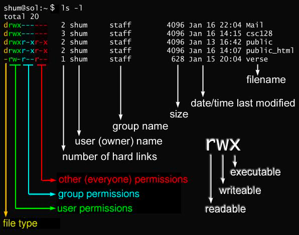

前端的后端 + 自动化运维知识体系 + 面试题

整个系列文章正在更新，每个主题参考了国内大量的付费课程总结而来。

- [计算机基础面试题](#计算机基础面试题)
  - [计算机组成原理基础知识 + 面试真题](#计算机组成原理基础知识--面试真题)
  - [计算机网络基础知识 + 面试真题](#计算机网络基础知识--面试真题)
  - [操作系统基础知识 + 面试真题](#操作系统基础知识--面试真题)
  - [算法leetcode简单题88道](#算法leetcode简单题88道)
  - [算法leetcode中等题](#算法leetcode中等题)
- [Linux相关](#linux相关)
  - [Linux基础知识](#linux基础知识)
  - [Shell脚本基础](#shell脚本基础)
  - [小公司业务架构](#小公司业务架构)
- [Javascript相关](#javascript相关)
  - [Js 基础问题](#js-基础问题)
  - [模块](#模块)
  - [事件/异步](#事件异步)
  - [进程](#进程)
  - [IO](#io)
  - [Network](#network)
  - [OS](#os)
  - [错误处理/调试](#错误处理调试)
  - [测试](#测试)
  - [存储](#存储)
  - [安全](#安全)
  - [nginx](#nginx)
  - [最后](#最后)


# 计算机基础面试题

简述

为什么需要了解计算机基础知识, 没有基本的计算机基础，比如基本的 node api 和一些后端常见的概念，比如进程，线程都会有很大的困难，所以了解基本计算机基础知识是必修。

之前在下总结了一下这部分的基础知识，深度适合没有基础的前端同学。

欢迎加我微信，进群一起学习：


## 计算机组成原理基础知识 + 面试真题

- [基础知识](./src/basic-of-computer/principles-of-computer-composition/principles-of-computer-composition.zh.md)
- [面试题](./src/basic-of-computer/principles-of-computer-composition/principles-of-computer-composition-interview.zh.md)
  - 字符编码相关：一个中文占多少字节？Unicode 跟编码有什么关系？js 是什么编码？
  - 为什么 0.1 + 0.2 不等于 0.3？为什么 0.1 + 0.1 等于 0.2 ？请结合 IEEE 标准来说，如何避免这种计算误差？
  - ...

## 计算机网络基础知识 + 面试真题

- [基础知识](./src/basic-of-computer/computer-network/computer-network.zh.md)
- [面试题](./src/basic-of-computer/computer-network/computer-network.interview.zh.md)
  - HTTPS 一定安全可靠吗？
  - url编码规则是什么？
  - 为什么Tcp 2次握手不行？什么是泛洪攻击？Tcp的安全可靠，不丢不重是如何做到的？


## 操作系统基础知识 + 面试真题

- [基础知识](./src/basic-of-computer/system-operation/system-operation.zh.md)
- [面试题](./src/basic-of-computer/system-operation/system-operation.interview.zh.md)
  - 进程和线程的区别与联系？
  - 为什么要有文件描述符？
  - 信号是什么? linux中kill命令默认发送的信号是什么，kill -9发送的信号是什么？


## 算法leetcode简单题88道

- [上半部分](./src/basic-of-computer/algorithms/leetcode-simple-44-2.md)
- [下半部分](./src/basic-of-computer/algorithms/leetcode-simple-44-1.md)
  - 美团面试题
    - 有效的字母异位词
    - 杨辉三角
  - 蔚来面试题
    - 合并两个有序数组
    - 二叉树层次遍历


## 算法leetcode中等题

- [待更新...]

# Linux相关

简述

你想玩全栈，Linux基础知识必须掌握，建议至少掌握到中级的水平，而且这些属于死记硬背的知识。这点努力都不愿意付出，就别谈学习后端知识了。

## Linux基础知识

- [基础知识](./src/linux/linux.zh.md)
- [面试题](./src/linux/linux.interview.zh.md)
  - linux 这边常用的查看日志的指令？
  - linux 下进程间通信方式？管道、共享内存什么场景下会用？两个进程不在同一个机器如何通信？
  - 何查看 linux 进程信息，其中 vsz 和 rss 有什么区别？


## Shell脚本基础

复杂的Shell脚本，建议直接用node.js去写（会python的也是py优先），但是简单的脚本还是要会写

- [待更新。。。]


## 小公司业务架构

主要包含的技术： 
- nginx做4层或者7层负载均衡
- 搭建nfs存储服务
- 搭建back up备份服务
- ssh免密登录
- 防火墙iptables

这些技术后期在学习k8s后，部分服务会跑在k8s中，并在k8s章节添加监控服务 + 日志服务，其实监控和日志细分的话太多了，我们做的可能比较粗糙，如果做的很专业，会花费巨大的精力，而且小公司架构确实也用不着，毕竟需要一个团队去维护单独的日志服务或者监控服务。



如果有对ci/cd感兴趣的，请看我的ci/cd教程

- [待更新。。。]

# Javascript相关

## [Js 基础问题](/src/common.md)

与前端 Js 不同, 后端方面除了 SSR/爬虫之外很少会接触 DOM, 所以关于 DOM 方面的各种知识基本不会讨论. 浏览器端除了图形业务外很少碰到内存问题, 但是后端几乎是直面服务器内存的, 更加偏向内存方面, 对于一些更基础的问题也会更加关注.

部分问题：

- [类型判断](/src/common.md)
  - typeof NaN 结果是什么？以及为什么？
- [类型判断](/src/common.md)
  - 如何精确判断引用类型？
- [原型链](/src/common.md)
  - Function.prototype === Object.**proto** 结果是什么，以及为什么？
- [作用域](/src/common.md)
  - javascript 是静态作用域还是动态作用域？
- [执行上下文栈](/src/common.md)
  - 有些人可能要说《高级程序设计》的 VO，AO，对不起，这是 ES3 的说法。答这道题就走远了
- [引用传递](/src/common.md)
  - js 中什么类型是引用传递, 什么类型是值传递? 如何将值类型的变量以引用的方式传递?

## [模块](/src/module.md)

模块机制详细分析文章可以参考我之前写的一篇文章[NodeJS 有难度的面试题，你能答对几个？](https://juejin.cn/post/6844903951742025736),最开始就讨论了 commonjs 的模块机制。

- [模块机制](/src/module.md)
  - 请介绍一下 node 里的模块是什么
  - 请介绍一下 require 的模块加载机制
- [热更新](/src/module.md)
  - 如何在不重启 node 进程的情况下热更新一个 js/json 文件? 这个问题本身是否有问题?
- [上下文](/src/module.md)
  - 每个 require 的 js 文件，作用域如何保证独立呢？
  - 知道 vm 模块有什么用吗？
- [包管理](/src/module.md)
  - npm 包管理下，node_modules 里安装的包是按什么结构和逻辑整理目录的

## [事件/异步](/src/event-async.md)

异步还是不异步? 这是一个问题.

- [Promise](/src/event-async.md)
  - 问烂的题就是问你什么是宏任务，什么是微任务，有啥区别，然后上个题问你打印顺序
- [Events (事件)](/src/event-async.md)
  - 如下情况是否会死循环?

```javascript
const EventEmitter = require("events");

let emitter = new EventEmitter();

emitter.on("myEvent", () => {
  console.log("hi");
  emitter.emit("myEvent");
});

emitter.emit("myEvent");
```

以及这样会不会死循环?

```javascript
const EventEmitter = require("events");

let emitter = new EventEmitter();

emitter.on("myEvent", function sth() {
  emitter.on("myEvent", sth);
  console.log("hi");
});

emitter.emit("myEvent");
```

- [阻塞/异步](/src/event-async.md)
  - 如何实现一个 sleep 函数
  - 如何实现一个异步的 reduce? (注:不是异步完了之后同步 reduce)
- [并行/并发](/src/event-async.md)
  - 并行和并发有啥区别

## [进程](/src/process.md)

后面的篇章需要了解操作系统的一些基本运行原理，才能更好的回答问题，比如进程就是一个典型的例子，以下链接是我之前写的关于操作系统的基础知识：
https://juejin.cn/post/6844904112803282957

- [Stream](/src/process.md)
  - 可读流默认是什么状态？
  - 背压是什么？知道 pipeline 吗？跟 pipe 有什么区别
  - [流内部机制](/src/AdvancedStream.md)
- [Process (进程)](/src/process.md)
  - 请回答进程、线程和协程的区别
  - RPC，LPC 中文啥意思？有啥区别吗
- [Child Processes (子进程)](/src/process.md)
  - spawn 、fork、exec、execFile 的区别？
- [Cluster (集群)](/src/process.md)
  - Cluster 底层使用的是 Child Processes, 那它的工作机制什么
- [进程间通信](/src/process.md)
  - 常见的 IPC 方式有哪些
- [守护进程](/src/process.md)
  - 请实现一个简易的 nodejs 编写的守护进程

## [IO](/src/io.md)

Node.js 是以 IO 密集型业务著称. 那么问题来了, 你真的了解什么叫 IO, 什么又叫 IO 密集型业务吗?

- [Buffer](/src/io.md)
  - Buffer 一般用于处理什么数据? 其长度能否动态变化?
  - Buffer.alloc()和 Buffer.allocUnsafe()有什么区别
- [String Decoder (字符串解码)](/src/io.md)
  - 知道 String Decoder 的应用场景吗？
- [File System (文件系统)](/src/io.md)
  - 什么是文件描述符? 输入流/输出流/错误流是什么?
- [Readline](/src/io.md)

* Readline 是如何实现的? (有思路即可)

## [Network](/src/network.md)

- [Net (网络)](/src/network.md)
  - 知道 TCP 的粘包是什么吗？
  - cookie 与 session 的区别? 服务端如何清除 cookie?
- [UDP/Datagram](/src/network.md)
  - 什么场景适用 udp
- [HTTP](/src/network.md)
  - 什么是跨域请求? 如何允许跨域?
  - 列举几个提高网络传输速度的办法?
- [DNS (域名服务器)](/src/network.md)
  - hosts 文件是什么? 什么叫 DNS 本地解析?
- [RPC](/src/network.md)
  - 常见 RPC 的方式有哪些

## [OS](/src/os.md)

- [TTY](/src/os.md)
  - 什么是 TTY? 如何判断是否处于 TTY 环境?
- [OS (操作系统)](/src/os.md)
  - 不同操作系统的换行符 (EOL) 有什么区别?
- [Path](/src/os.md)
  - 为什么要用 path 模块去处理路径（兼容性问题）
- [命令行参数](/src/os.md)

## [错误处理/调试](/src/error.md)

- [`[Doc]` Errors (异常)](/src/error.md)
  - javascript 标准错误分为几种
  - 怎么处理未预料的出错? 用 try/catch ，还是其它什么?
  - 什么是 `uncaughtException` 事件? 一般在什么情况下使用该事件?
  - 什么是防御性编程? 与其相对的 let it crash 又是什么?
  - 为什么有些异常没法根据报错信息定位到代码调用? 如何准确的定位一个异常?
- [`[Doc]` Debugger (调试器)](/src/error.md)
  - 内存泄漏通常由哪些原因导致? 如何分析以及定位内存泄漏?

## [测试](/src/test.md)

- [单元测试](/src/test.md)
  - 为什么要写测试? 写测试是否会拖累开发进度?什么是覆盖率?
  - 平时自己用的单测工具（前端和 node 部分）
- [压力测试](/src/test.md)
  - 压测的目的是什么

## [存储](/src/storage.md)

- [`[Point]` Mysql](/src/storage.md)
  - 索引有什么用，大致原理是什么? 设计索引有什么注意点?
  - char 和 varchar 字符宽度的区别
  - 字符集 utf8 和 utf8mb4 的区别
  - 为什么需要规范 sql 数据规范化？
- [`[Point]` Mongodb](/src/storage.md)
- [`[Point]` 数据一致性](/src/storage.md)
  - 什么是数据一致性，如何解决
  - 什么是事务，在 mysql 如何开启

## [安全](/src/security.md)

- [Crypto (加密)](/src/security.md)
  - 知道对称加密和非对称加密吗？https 中它们彼此是如何协作的呢？
- [HTTPS](/src/security.md)
  - https 解决 http 的哪些问题？https 是如何解决
- [XSS](/src/security.md)
  - 过滤 Html 标签能否防止 XSS?
- [CSRF](/src/security.md)
  - 什么是 CSRF，如何防止？
- [中间人攻击](/src/security.md)
  - 如何避免中间人攻击?
- [Sql/Nosql 注入](/src/security.md)
  - 为什么会产生 sql 注入

## [nginx](/src/nginx.md)

- [Nginx 怎么处理请求的？](/src/nginx.md)
- [Nginx 是如何实现高并发的？](src/nginx.md)

## 最后

欢迎大家一起共建这个知识库，以及不吝啬 star 哦！感谢！
