本文题目选自 [LeetCode 精选 TOP 面试题](https://link.juejin.cn/?target=leetcode-cn.com%2Fproblem-list%2F2ckc81c%2F "leetcode-cn.com/problem-list/2ckc81c/")，这些题在自己和同事亲身经历中，确实遇到的几率在`百分之80%`以上（成都和北京的前端岗位）。

本篇是简单题（下）20题左右，上半部分详见[# 简单题上（22题左右）](https://juejin.cn/post/6987320619394138148)

## 二叉树（DFS）
## 二叉树前中后遍历套路详解
前序遍历题目如下：

root节点是A节点（下图的A节点），然后让你按照下图数字的顺序依次打印出节点。


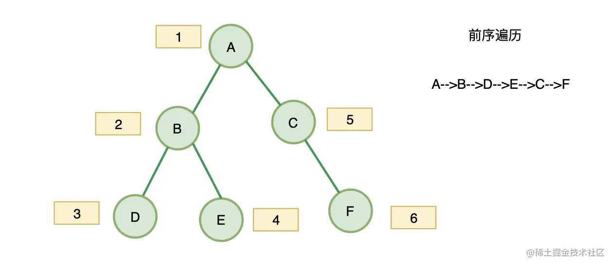

我们可以看到这其中的规律，就是`深度优先遍历，先遍历左子树，再遍历右子树`，这里我们不用递归，因为一些大厂严格要求二叉树遍历不用递归，递归太简单了。

重点思路就是：`深度优先遍历，先遍历左子树，再遍历右子树`，

所以，我们需要一套如何遍历一颗二叉树，并且是先左子树，再右子树的通用模板，如下

```javascript
var Traversal = function(root) {
    const stack = [];
    while (root || stack.length){
      while(root){
        stack.push(root);
        root = root.left;
      }
      root = stack.pop();
      root = root.right;
    }
    return res;
};
```
我们结合图片发现这个遍历产生的整体压栈的顺序是

- A、B、D入栈，
- D出栈
- B出栈
- E入栈
- E出栈
- A出栈
- C入栈
- C出栈
- F入栈
- F出栈

我们把上面入栈的元素按顺序排列一下就是，A、B、D、E、C、F，而这就是前序遍历的顺序！解答完毕！

是不是很有意思，下面的中序遍历，我们看看出栈顺序是不是中序遍历的要求：D、B、E、A、C、F（这就是中序遍历的要求，好了，两个题解决）

放具体前序遍历代码：
```javascript
var preorderTraversal = function(root) {
    // 初始化数据
    const res =[];
    const stack = [];
    while (root || stack.length){
      while(root){
        res.push(root.val);
        stack.push(root);
        root = root.left;
      }
      root = stack.pop();
      root = root.right;
    }
    return res;
};
```


中序遍历是一个意思，在前序遍历的基础上改造一下
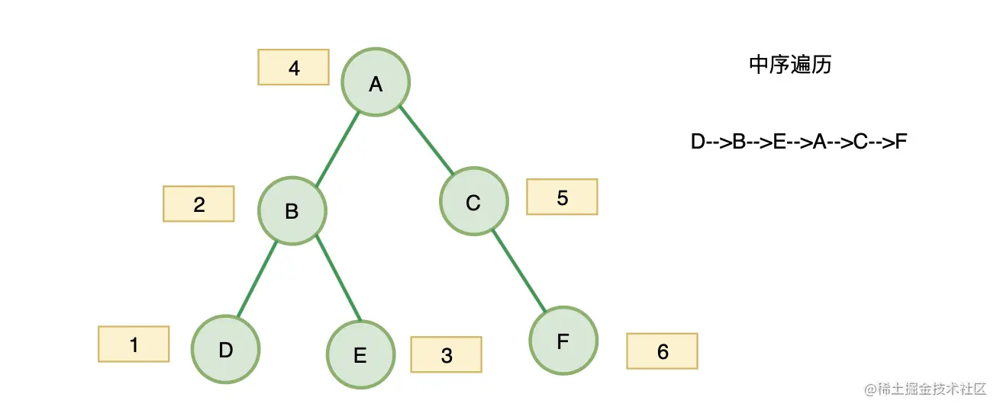
```javascript
var preorderTraversal = function(root) {
    // 初始化数据
    const res =[];
    const stack = [];
    while (root || stack.length){
      while(root){
        stack.push(root);
        root = root.left;
      }
      root = stack.pop();
      res.push(root.val);
      root = root.right;
    }
    return res;
};
```
后序遍历有点不太一样，但是套路是一样的，我们需要先遍历右子树，再遍历左子树，反着来，就可以了，代码如下：

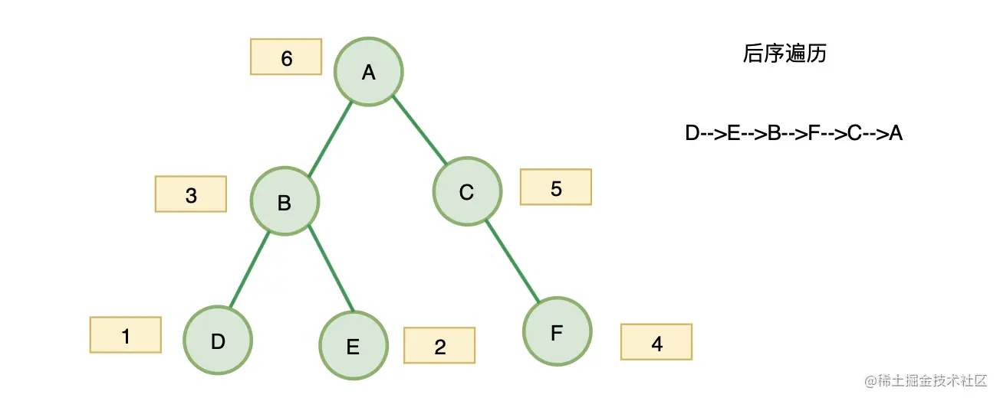
```javascript
var postorderTraversal = function(root) {
  // 初始化数据
    const res =[];
    const stack = [];
    while (root || stack.length){
      while(root){
        stack.push(root);
        res.unshift(root.val);
        root = root.right;
      }
      root = stack.pop();
      root = root.left;
    }
    return res;
};
```


## 对称二叉树

这个题简而言之就是判断一个二叉树是对称的，比如说：

二叉树 [1,2,2,3,4,4,3] 是对称的。
```
    1
   / \
  2   2
 / \ / \
3  4 4  3
```

但是下面这个 [1,2,2,null,3,null,3] 则不是镜像对称的:
```
    1
   / \
  2   2
   \   \
   3    3

```

思路：

递归解决：

- 判断两个指针当前节点值是否相等
- 判断 `A` 的右子树与 `B` 的左子树是否对称
- 判断 `A` 的左子树与 `B` 的右子树是否对称


```javascript
function isSame(leftNode, rightNode){
    if(leftNode === null && rightNode === null) return true;
    if(leftNode === null || rightNode === null) return false;
    return leftNode.val === rightNode.val && isSame(leftNode.left, rightNode.right) && isSame(leftNode.right, rightNode.left)
}
var isSymmetric = function(root) {
    if(!root) return root;
    return isSame(root.left, root.right);
};
```
## 二叉树的最大深度

这个题在面试滴滴的时候遇到过，主要是掌握二叉树遍历的套路
- 只要遍历到这个节点既没有左子树，又没有右子树的时候
- 说明就到底部了，这个时候如果之前记录了深度，就可以比较是否比之前记录的深度大，大就更新深度
- 然后以此类推，一直比较到深度最大的
```javascript
var maxDepth = function(root) {
    if(!root) return root;
    let ret = 1;
    function dfs(root, depth){
        if(!root.left && !root.right) ret = Math.max(ret, depth);
        if(root.left) dfs(root.left, depth+1);
        if(root.right) dfs(root.right, depth+1);
    }
    dfs(root, ret);
    return ret
};
```

## 将有序数组转化为二叉搜索树

我们先看题：

给你一个整数数组 nums ，其中元素已经按 升序 排列，请你将其转换为一棵 高度平衡 二叉搜索树。

高度平衡 二叉树是一棵满足「每个节点的左右两个子树的高度差的绝对值不超过 1 」的二叉树。

 

示例 1：

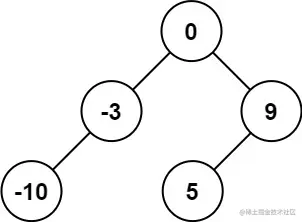
```JAVASCRIPT
输入：nums = [-10,-3,0,5,9]
输出：[0,-3,9,-10,null,5]
解释：[0,-10,5,null,-3,null,9] 也将被视为正确答案：
```
示例 2：

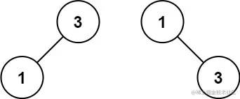
```JAVASCRIPT
输入：nums = [1,3]
输出：[3,1]
解释：[1,3] 和 [3,1] 都是高度平衡二叉搜索树。
 

提示：

1 <= nums.length <= 104
-104 <= nums[i] <= 104
nums 按 严格递增 顺序排列
```

思路：
- 构建一颗树包括：构建`root、构建 root.left 和 root.right`
- 题目要求"高度平衡" — 构建 `root` 时候，选择数组的中间元素作为 `root `节点值，即可保持平衡。
- 递归函数可以传递数组，也可以传递指针，选择传递指针的时候： l r 分别代表参与构建BST的数组的首尾索引。


```JAVASCRIPT
var sortedArrayToBST = function(nums) {
    return toBST(nums, 0, nums.length - 1)
};
const toBST = function(nums, l, r){
    if( l > r){
        return null;
    }
    const mid = l + r >> 1;
    const root = new TreeNode(nums[mid]);
    root.left = toBST(nums, l, mid - 1);
    root.right = toBST(nums, mid + 1, r);

    return root;
}
```

### 栈
栈是一种先进后出的数据结构，所以涉及到你需要`先进后出`这个想法后，就可以使用栈。

其次我觉得栈跟递归很相似，递归是不是先压栈，然后先进来的先出去，就跟函数调用栈一样。

## 20. 有效的括号

这是一道很典型的用栈解决的问题，
给定一个只包括 '('，')'，'{'，'}'，'['，']' 的字符串 s ，判断字符串是否有效。

有效字符串需满足：

左括号必须用相同类型的右括号闭合。
左括号必须以正确的顺序闭合。
 
```javascript
示例 1：

输入：s = "()"
输出：true
示例 2：

输入：s = "()[]{}"
输出：true
示例 3：

输入：s = "(]"
输出：false
示例 4：

输入：s = "([)]"
输出：false
```
思路：
这道题有一规律：
1.  右括号前面，必须是相对应的左括号，才能抵消！
1.  右括号前面，不是对应的左括号，那么该字符串，一定不是有效的括号！

也就是说左括号我们直接放入栈中即可，发现是右括号就要对比是否跟栈顶元素相匹配，不匹配就返回false
```JAVASCRIPT
var isValid = function(s) {
    const map = { '{': '}', '(': ')', '[': ']' };
    const stack = [];
    for(let i of s){
        if(map[i]){
            stack.push(i);
        } else {
            if(map[stack[stack.length - 1]] === i){
                stack.pop()
            }else{
                return false;
            }
        }
    }
    return stack.length === 0;
};
```
## 155、 最小栈
先看题目：

设计一个支持 `push ，pop ，top` 操作，并能在常数时间内检索到最小元素的栈。

- push(x) —— 将元素 x 推入栈中。
- pop() —— 删除栈顶的元素。
- top() —— 获取栈顶元素。
- getMin() —— 检索栈中的最小元素。
 
```javascript
示例:

MinStack minStack = new MinStack();
minStack.push(-2);
minStack.push(0);
minStack.push(-3);
minStack.getMin();   --> 返回 -3.
minStack.pop();
minStack.top();      --> 返回 0.
minStack.getMin();   --> 返回 -2.

提示：

pop、top 和 getMin 操作总是在 非空栈 上调用。
```
我们先不写getMin方法，满足其他方法实现就非常简单，我们来看一下：

```JAVASCRIPT
var MinStack = function() {
    this.stack = [];
};

MinStack.prototype.push = function(x) {
    this.stack.push(x);
};

MinStack.prototype.pop = function() {
    this.stack.pop();
};

MinStack.prototype.top = function() {
    return this.stack[this.stack.length - 1];
};
```
如何保证每次取最小呢，我们举一个例子：
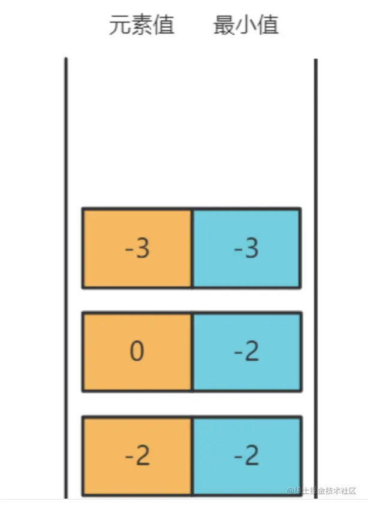

如上图，我们需要一个辅助栈来记录最小值，
- 开始我们向stack push -2
- 此时辅助栈minStack，因为此时stack最小的是-2，也push -2
- stack push 0
- 此时辅助站minStack 会用 0 跟 -2对比，-2更小，minstack会push -2
- stack push -3
- 此时辅助站minStack 会用 -3 跟 -2对比，-3更小，minstack会push -3

所以我们取最小的时候，总能在minStack中取到最小值，所以解法就出来了：

```JAVASCRIPT
var MinStack = function() {
    this.stack = [];
    // 辅助栈
    this.minStack = [];
};

MinStack.prototype.push = function(x) {
    this.stack.push(x);
    // 如果是第一次或者当前x比最小栈里的最小值还小才push x
    if(this.minStack.length === 0 || x < this.minStack[this.minStack.length - 1]){
        this.minStack.push(x)
    } else {
         this.minStack.push( this.minStack[this.minStack.length - 1])
    }
};

MinStack.prototype.pop = function() {
    this.stack.pop();
    this.minStack.pop();
};

MinStack.prototype.top = function() {
    return this.stack[this.stack.length - 1];
};

MinStack.prototype.getMin = function() {
    return this.minStack[this.stack.length - 1];
};
```
## 动态规划
动态规划，一定要知道动态转移方程，有了这个，就相当于解题的钥匙，我们从题目中体会一下
## 53. 最大子序和

题目如下：

给定一个整数数组 nums ，找到一个具有最大和的连续子数组（子数组最少包含一个元素），返回其最大和。
 
```JAVASCRIPT
示例 1：

输入：nums = [-2,1,-3,4,-1,2,1,-5,4]
输出：6
解释：连续子数组 [4,-1,2,1] 的和最大，为 6 。
示例 2：

输入：nums = [1]
输出：1
示例 3：

输入：nums = [0]
输出：0
```

思路：
- 这道题可以用动态规划来解决，关键是找动态转移方程
- 我们动态转移方程中，dp表示每一个nums下标的最大自序和，所以dp[i]的意思为：包括下标i之前的最大连续子序列和为dp[i]。

确定转义方程的公示：

dp[i]只有两个方向可以推出来：

- 1、如果dp[i - 1] < 0，也就是当前遍历到nums的i，之前的最大子序和是负数，那么我们就没必要继续加它了，因为dp[i] = dp[i - 1] + nums[i] 会比nums[i]更小，所以此时还不如dp[i] = nums[i]，就是目前遍历到i的最大子序和呢
- 2、同理dp[i - 1] > 0，说明nums[i]值得去加dp[i - 1]，此时回避nums[i]更大

这样代码就出来了，其实更多的就是求dp，遍历nums每一个下标都会产生最大子序和，我们记录下来即可

```JAVASCRIPT
var maxSubArray = function(nums) {
  let res = nums[0];
  const dp = [nums[0]];
  for(let i=1;i < nums.length;i++){
      if(dp[i-1]>0){
        dp[i]=nums[i]+dp[i-1]
      }else{
       dp[i]=nums[i]
      }
      
    res=Math.max(dp[i],res)
  }
    return res
};
```

## 70. 爬楼梯
先看题目：

假设你正在爬楼梯。需要 n 阶你才能到达楼顶。

每次你可以爬 1 或 2 个台阶。你有多少种不同的方法可以爬到楼顶呢？

注意：给定 n 是一个正整数。

```javascript
示例 1：

输入： 2
输出： 2
解释： 有两种方法可以爬到楼顶。
1.  1 阶 + 1 阶
2.  2 阶
示例 2：

输入： 3
输出： 3
解释： 有三种方法可以爬到楼顶。
1.  1 阶 + 1 阶 + 1 阶
2.  1 阶 + 2 阶
3.  2 阶 + 1 阶
```
涉及到动态规划，一定要知道动态转移方程，有了这个，就相当于解题的钥匙，

这道题我们假设`dp[10]`表示爬到是你爬到`10`阶就到达楼顶的方法数，

那么，`dp[10]` 是不是就是你爬到8阶，然后再走`2`步就到了，还有你走到`9`阶，再走`1`步就到了，

所以 `dp[10]` 是不是等于 `dp[9]+dp[8]`

延伸一下 `dp[n]` 是不是等于 `dp[n - 1] + dp[n - 2]`

代码如下：

```JAVASCRIPT
var climbStairs = function(n) {
    const dp = {};
    dp[1] = 1;
    dp[2] = 2;
    for(let i = 3; i <= n; i++){
        dp[i] = dp[i-1] + dp[i-2]
    }
    return dp[n]
};
```


## 数学问题
以下更多的是涉及数学问题，这些解法非常重要，因为在中级题里面会经常用到，比如我们马上讲到的`加一`这个题，
中级的两数相加都是一个模板。

## 66. 加一
题目如下：

给定一个由 整数 组成的 非空 数组所表示的非负整数，在该数的基础上加一。

最高位数字存放在数组的首位， 数组中每个元素只存储单个数字。

你可以假设除了整数 0 之外，这个整数不会以零开头。

```javascript
示例 1：

输入：digits = [1,2,3]
输出：[1,2,4]
解释：输入数组表示数字 123。
示例 2：

输入：digits = [4,3,2,1]
输出：[4,3,2,2]
解释：输入数组表示数字 4321。
示例 3：

输入：digits = [0]
输出：[1]
```
这个题的关键有两点：
- 需要有一个进位的变量carry记录到底进位是几
- 还需要一个每次迭代都重置和的变量sum来帮我们算是否进位，以及进位后的数字

记住这个题，这是两数字相加的套路，这次是+1，其实就是两数相加的题（腾讯面试遇到过两数相加）

```javascript
var plusOne = function(digits) {
  let carry = 1; // 进位（因为我们确定+1，初始化进位就是1）
  for(let i = digits.length - 1; i >= 0; i--){
      let sum = 0; // 这个变量是用来每次循环计算进位和digits[i]的值的
      sum = digits[i] + carry; 
      digits[i] = sum % 10; // 模运算取个位数
      carry = (sum / 10) | 0; //  除以10是取百位数，并且｜0表示舍弃小数位
  }
  if(digits[0] === 0) digits.unshift(carry);
  return digits
};
```

## 69 x的平方根
题目如下：
实现 int sqrt(int x) 函数。

计算并返回 x 的平方根，其中 x 是非负整数。

由于返回类型是整数，结果只保留整数的部分，小数部分将被舍去。

示例 1:
```javascript
输入: 4
输出: 2
```
示例 2:
```javascript
输入: 8
输出: 2
说明: 8 的平方根是 2.82842..., 
     由于返回类型是整数，小数部分将被舍去。
```
这道题是典型的二分法解题，所以我们需要熟悉二分法的通用模板，我们出一个题：

**在 [1, 2, 3, 4, 5, 6] 中找到 4，若存在则返回下标，不存在返回-1**

```javascript
const arr = [1, 2, 3, 4, 5, 6];
function getIndex1(arr, key) {
  let low = 0;
  const high = arr.length - 1;
  while (low <= high) {
    const mid = Math.floor((low + high) / 2);
    if (key === arr[mid]) {
      return mid;
    }
    if (key > arr[mid]) {
      low = mid + 1;
    } else {
      height = mid - 1;
    }
  }
  return -1;
}
console.log(getIndex1(arr, 5)); // 4
```
所以这道题的意思就是，我们找一个数平方跟x最相近的数，二分法的用法中也有找相近数的功能

所以代码如下：
```javascript
var mySqrt = function(x) {
    let [l , r] = [0, x];
    let ans = -1;
    while(l <= r) {
        const mid = (l + r) >> 1;
        if(mid * mid > x){
            r = mid - 1
        } else if(mid * mid < x){
            ans = mid; // 防止越界
            l = mid + 1;
        } else {
            ans = mid;
            return ans;
        }
    }
    return ans;
};
};
```
## 171. Excel表序列号

这个题比较重要，也比较基础，简而言之就是进制转换，必须牢牢掌握

题目如下：

给你一个整数 columnNumber ，返回它在 Excel 表中相对应的列名称。

例如：
```
A -> 1
B -> 2
C -> 3
...
Z -> 26
AA -> 27
AB -> 28 
...
```


```javascript
示例 1：

输入：columnNumber = 1
输出："A"
示例 2：

输入：columnNumber = 28
输出："AB"
示例 3：

输入：columnNumber = 701
输出："ZY"
示例 4：

输入：columnNumber = 2147483647
输出："FXSHRXW"
```
说白了，这就是一道26进制的问题，n进制转10进制，都是一个算法。
例如`2`进制`101.1`如何转化为`10`进制。（有些同学觉得可以用`parseInt('101.1', 2)`，这个是不行的，因为`parseInt`返回整数）

转化方法如下（按权相加法）： 2进制的 101.1 = 1 x 22 + 0 x 21 + 1 x 20 + 1 x 2-1

规律就是`二进制`的每个数去`乘以2`的相应次方,注意小数点后是乘以它的`负相应次方`。

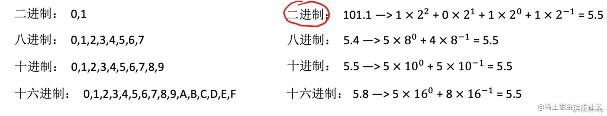

所以这个26进制的是一样 思路，但是注意A是从1开始数，没有0，所以注意+1。

```JAVASCRIPT
var titleToNumber = function(columnTitle) {
    let ans = 0;
    let columnTitleLen = columnTitle.length - 1;
    for(let i = columnTitleLen; i >= 0; i--){
        ans += (26 ** (columnTitleLen - i)) * (columnTitle[i].charCodeAt() - 'A'.charCodeAt() + 1);
    }
    return ans;
};
```
## 172. 阶乘中的零
题目：

给定一个整数 n，返回 n! 结果尾数中零的数量。
```javascript
示例 1:

输入: 3
输出: 0
解释: 3! = 6, 尾数中没有零。
示例 2:

输入: 5
输出: 1
解释: 5! = 120, 尾数中有 1 个零.
```
这道题很简单，有多少个5就有多少个0，为什么这么说呢，我们分析一下题目

比如说 5!，
- 也就是 `5 * 4 * 3 * 2 * 1 = 120`，我们发现只有1个0，怎么产生的呢，主要造成者就是 2 * 5 构造了一个0

- 再看看10!
10! = 10 * 9 * 8 * 7 * 6 * 5 * 4 * 3 * 2 * 1
其中，除了10 = 2 * 5和本身有一对2 * 5，所以有两个0，这样这道题的规律就出来了，我们再精进一步


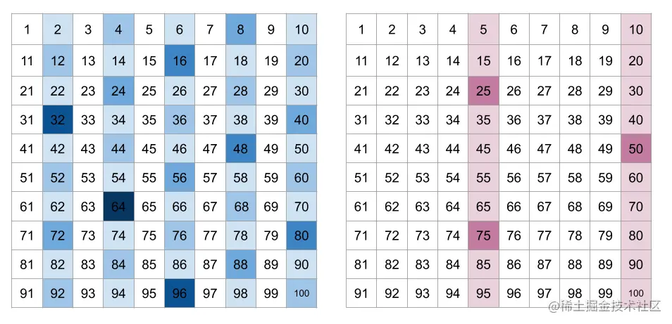

如上图，每四个数字都会出现一个或者多个2的因子，但是只有每 5 个数字才能找到一个或多个5的因子。所以总体上看来，2的因子是远远多于5的因子的，所以我们只需要找5的倍数就可以了。

我们再进一步，按照上面的说法，我们需要计算比如10的阶乘有多少个0，要把10的阶乘算出来，其实我们只需要算10有几个5就好了，为什么呢

我们发现只有5的倍数的阶乘，才会产生5, 所以我们需要看看阶层数有多少个5，代码如下：
```javascript
var trailingZeroes = function (n) {
  let r = 0;
  while (n > 1) {
    n = Math.floor(n / 5);
    r += n;
  }
  return r;
};
```
## 190.颠倒二进制位
题目如下：

颠倒给定的 32 位无符号整数的二进制位。


示例 1：
```javascript
输入: 00000010100101000001111010011100
输出: 00111001011110000010100101000000
解释: 输入的二进制串 00000010100101000001111010011100 表示无符号整数 43261596，
     因此返回 964176192，其二进制表示形式为 00111001011110000010100101000000。
```

示例 2：

```javascript
输入：11111111111111111111111111111101
输出：10111111111111111111111111111111
解释：输入的二进制串 11111111111111111111111111111101 表示无符号整数 4294967293，
     因此返回 3221225471 其二进制表示形式为 10111111111111111111111111111111 。
```

这类题，就是翻转字符串，我们可以把其转为字符串，再转成数组，再reverse一下，这里我们选用数学的方式去解答，不用这种转字符串的方式。

解答这道题之前，我们需要了解的前置知识：

1.  与预算 `&`

```
1 & 1 // 1的2进制最后一位是1，得到1
2 & 0 // 2的2进制最后一位是0，得到0
3 & 1 // 3的2进制最后一位是1，得到1
4 & 0 // 4的2进制最后一位是0，得到0
```
所以我们知道了怎么取10进制最后1位的2进制是几。


2.  JavaScript 使用 32 位按位运算数(意思是我们的按位运算都会转成32位，你的数字不能超过32位，会出问题)

- JavaScript 将数字存储为 64 位浮点数，但所有按位运算都以 32 位二进制数执行。

- 在执行位运算之前，JavaScript 将数字转换为 32 位有符号整数。

- 执行按位操作后，结果将转换回 64 位 JavaScript 数。

3.  `'<< 1' 运算`

这个运算实际上就是把10进制乘以2，这个乘2在2进制上表现出右边填了一个0，我们距举例来说，

- 2的2进制是 10，2 << 1 得到4， 4的2进制是100，所以比10多了个0
- 3的2进制是 11，3 << 1 得到6。 6的2进制是110，所以比11多了个0

以上就是规律


思路：循环取最后一位拼接起来即可

```javascript
var reverseBits = function (n) {
  let result = 0
  for (let i = 0; i < 32; i++) {
    result = (result << 1) + (n & 1)
    n = n >> 1
  }
  // 为什么要 >>> 0 呢，一位javascript没有无符号整数，全是有符号的
  // 不>>>0的话，得出来的值是负数，但是无符号整数是没有符号的
  // javascript 有符号转化为无符号的方法就是>>>0
  return result >>> 0
}
```

## 268. 丢失的数字


题目如下：

给定一个包含 [0, n] 中 n 个数的数组 nums ，找出 [0, n] 这个范围内没有出现在数组中的那个数。

进阶：

你能否实现线性时间复杂度、仅使用额外常数空间的算法解决此问题?
 
```javascript
示例 1：

输入：nums = [3,0,1]
输出：2
解释：n = 3，因为有 3 个数字，所以所有的数字都在范围 [0,3] 内。2 是丢失的数字，因为它没有出现在 nums 中。
示例 2：

输入：nums = [0,1]
输出：2
解释：n = 2，因为有 2 个数字，所以所有的数字都在范围 [0,2] 内。2 是丢失的数字，因为它没有出现在 nums 中。
```

这题很简单，就是用0-n的总和减去数组总和
- 0 - n 的总和用等差数列:`（首数+尾数）* 项数 / 2 `来求

```javascript
 var missingNumber = function(nums) {
    const len = nums.length
 
   let sum = ((1 + len) * len) / 2
 
   for (let i = 0; i < len; i++) {
     sum -= nums[i]
   }
 
   return sum
 }
```

## 3的幂
题目如下：


给定一个整数，写一个函数来判断它是否是 3 的幂次方。如果是，返回 true ；否则，返回 false 。

整数 n 是 3 的幂次方需满足：存在整数 x 使得 `n == 3的x次方`
 
```javascript
示例 1：

输入：n = 27
输出：true
示例 2：

输入：n = 0
输出：false
示例 3：

输入：n = 9
输出：true
```

思路
- 我们拿27来说：27 = 3 * 3 * 3，所以27是3的幂次方
- 我们拿29来说： 29 = 3 * 3 * 3点几
也就是说，如果是3的幂次方，一直除以3，除到最后就等于1比如27/3/3/3等于1
如果不是3的幂次方，除到最后就是3点几/3 等于1点几

代码就出来了判断是不是等于1即可
```javascript
var isPowerOfThree = function(n) {
    while(n >= 3){
        n /= 3;
    }
    return n === 1;
};
```
## 412. Fizz Buzz
这个题没啥好说的，就按照题目说的写代码就行，先看题目：

写一个程序，输出从 1 到 n 数字的字符串表示。

1. 如果 n 是3的倍数，输出“Fizz”；

2. 如果 n 是5的倍数，输出“Buzz”；

3. 如果 n 同时是3和5的倍数，输出 “FizzBuzz”。
```javascript
示例：

n = 15,

返回:
[
    "1",
    "2",
    "Fizz",
    "4",
    "Buzz",
    "Fizz",
    "7",
    "8",
    "Fizz",
    "Buzz",
    "11",
    "Fizz",
    "13",
    "14",
    "FizzBuzz"
]
```

```javascript
  var fizzBuzz = function (n) {
    const list = [];
    for (let i = 1; i <= n; i++) {
      const is3Times = i % 3 === 0; // 是否是3的倍数
      const is5Times = i % 5 === 0; // 是否是5的倍数
      const is15Times = is3Times && is5Times; // 是否是15的倍数
      if (is15Times) {
        list.push('FizzBuzz');
        continue;
      }
      if (is3Times) {
        list.push('Fizz');
        continue;
      }
      if (is5Times) {
        list.push('Buzz');
        continue;
      }
      list.push(`${i}`);
    }
    return list;
  };
```
- 7. 整数反转
这个题跟之前的excel序号题差不多，我们先看题目：

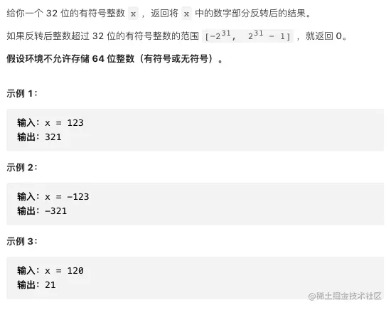

思路如下：
这道题可以将数字转字符串然后翻转，我们不用这种方法，用更纯正的数学方法，速度和效率更好。

假设我们有一个数字12345，下图展示了翻转的过程

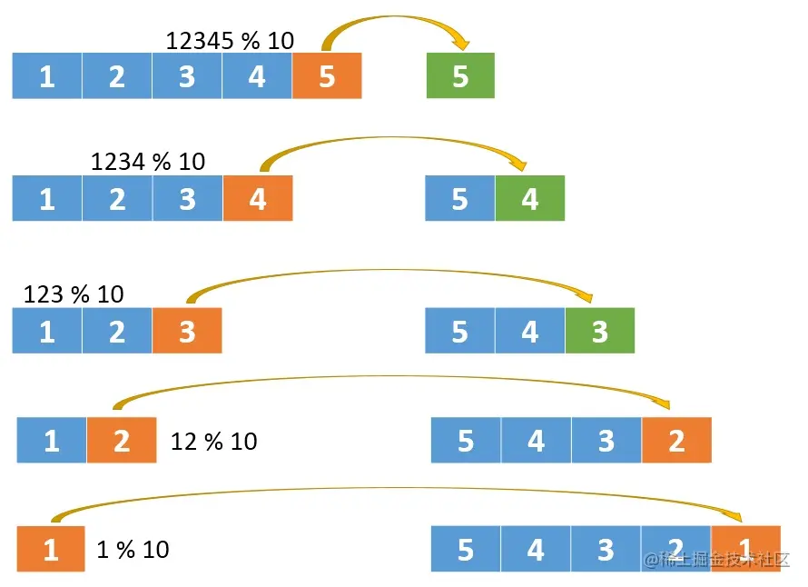
```javascript
var reverse = function(x) {
    let ret = 0;
    while(x){
        ret = ret * 10 + x % 10;
        if(ret > Math.pow(2, 31) - 1 || ret < Math.pow(-2, 31)) return 0;
        x = (x / 10) | 0
    }
    return ret
};
```
## 环问题

这类问题的特点就是，你要循环寻找，到底怎么循环寻找，看题便知。
## 141. 环形链表

题目如下：

给定一个链表，判断链表中是否有环。

如果链表中有某个节点，可以通过连续跟踪 next 指针再次到达，则链表中存在环。 为了表示给定链表中的环，我们使用整数 pos 来表示链表尾连接到链表中的位置（索引从 0 开始）。 如果 pos 是 -1，则在该链表中没有环。注意：pos 不作为参数进行传递，仅仅是为了标识链表的实际情况。

如果链表中存在环，则返回 true 。 否则，返回 false 。

**示例 1：**

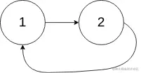
```
输入： head = [3,2,0,-4], pos = 1
输出： true
解释： 链表中有一个环，其尾部连接到第二个节点。
```
**示例 2：**
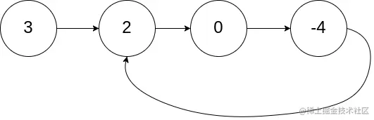
```
输入： head = [1,2], pos = 0
输出： true
解释： 链表中有一个环，其尾部连接到第一个节点。
```
我们采用标记法：

给遍历过的节点打记号，如果遍历过程中遇到有记号的说明已环

```javascript
var hasCycle = function(head) {
    let traversingNode = head;
    while(traversingNode){
        if(traversingNode.isVistitd) return true
        traversingNode.isVistitd = true
        traversingNode = traversingNode.next
    }
    return false;
};
```
## 160. 相交链表

题目如下：

给你两个单链表的头节点 headA 和 headB ，请你找出并返回两个单链表相交的起始节点。如果两个链表没有交点，返回 null 。

图示两个链表在节点 c1 开始相交：

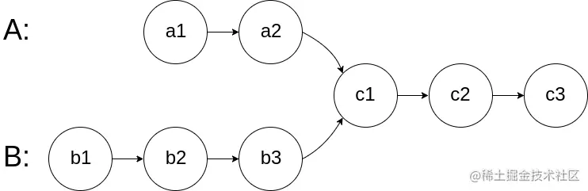

题目数据 **保证** 整个链式结构中不存在环。

**注意**，函数返回结果后，链表必须 **保持其原始结构** 。

示例 1：

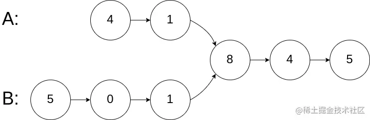

```javascript
输入：intersectVal = 8, listA = [4,1,8,4,5], listB = [5,0,1,8,4,5], skipA = 2, skipB = 3
输出：Intersected at '8'
解释：相交节点的值为 8 （注意，如果两个链表相交则不能为 0）。
从各自的表头开始算起，链表 A 为 [4,1,8,4,5]，链表 B 为 [5,0,1,8,4,5]。
在 A 中，相交节点前有 2 个节点；在 B 中，相交节点前有 3 个节点。
```

示例 2：

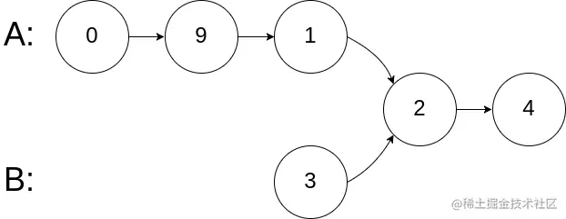
```javascript
输入：intersectVal = 2, listA = [0,9,1,2,4], listB = [3,2,4], skipA = 3, skipB = 1
输出：Intersected at '2'
解释：相交节点的值为 2 （注意，如果两个链表相交则不能为 0）。
从各自的表头开始算起，链表 A 为 [0,9,1,2,4]，链表 B 为 [3,2,4]。
在 A 中，相交节点前有 3 个节点；在 B 中，相交节点前有 1 个节点。
```
思路：

使用双指针的思路，两个指针分别指向两个链表的头部
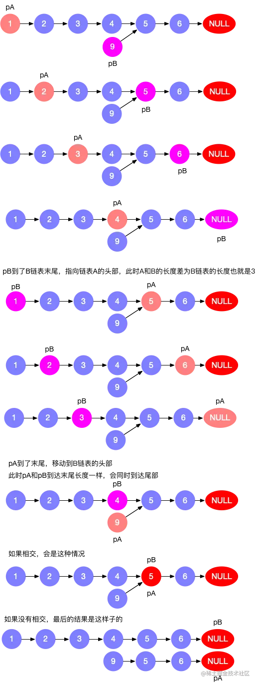

参考解答：
```javascript
var getIntersectionNode = function(headA, headB) {
    let tempHeadA = headA;
    let tempHeadB = headB;

    while(tempHeadA !== tempHeadB){
        tempHeadA = tempHeadA !== null ? tempHeadA.next : headB;
        tempHeadB = tempHeadB !== null ? tempHeadB.next : headA;
    }

    return tempHeadA;
};
```
## 202. 快乐数

题目如下：
编写一个算法来判断一个数 n 是不是快乐数。

「快乐数」定义为：

- 对于一个正整数，每一次将该数替换为它每个位置上的数字的平方和。
- 然后重复这个过程直到这个数变为 1，也可能是 无限循环 但始终变不到 1。
- 如果 可以变为  1，那么这个数就是快乐数。
- 如果 n 是快乐数就返回 true ；不是，则返回 false 。


 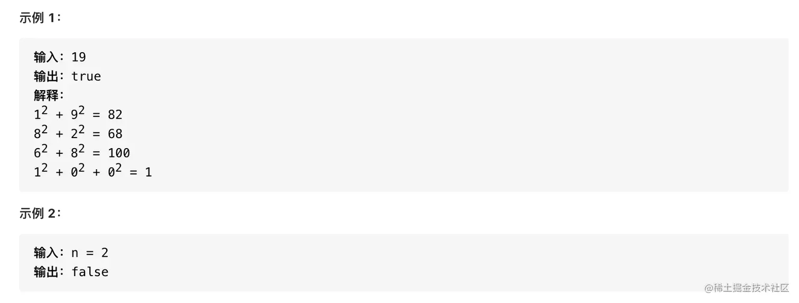


快乐数怎么分析呢？

我们来看一个表，就会得出结论，一个数按照快乐数定义的方式分别每个数字平方，会有两种情况

- 1. 得到`1`
- 2. 无限循环

无限循环参照下图

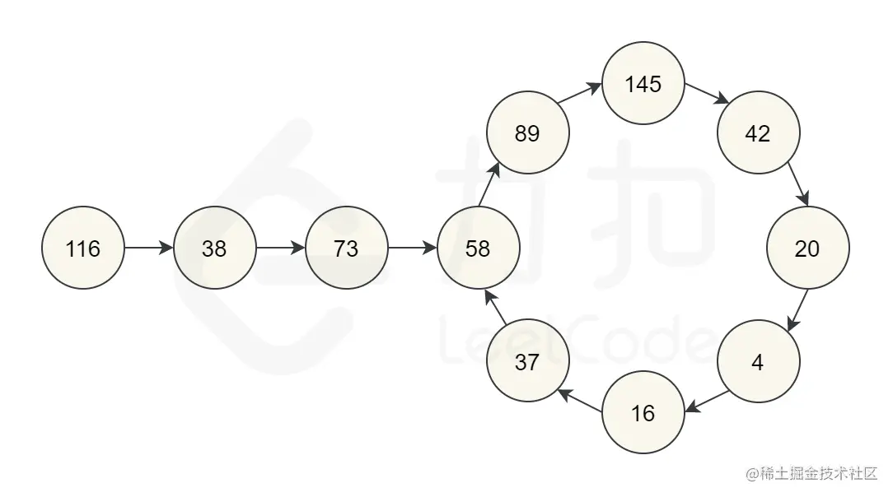

有人会说会不会一直变大，答案是不会：
我们看下面列表，

- 可以看到如果你是13位，你的下一次快乐数算法会变为4位1053，
- 如果你是`9999`, `4`位，下一个快乐数是`324`
| 位数 | 位数对应最大值 | 下一个快乐数 |
| ---- | -------------- | ------------ |
| 1    | 9              | 81           |
| 2    | 99             | 162          |
| 3    | 999            | 243          |
| 4    | 9999           | 324          |
| 13   | 9999999999999  | 1053         |


所以代码只要判断这两种就行了，代码如下：

```javascript
// 封装获取快乐数的方法
function getNext(n){
    n = String(n);
    let sum = 0;
    for(let num of n){
        sum = sum + Math.pow(+num, 2);
    }
    return sum;
}
var isHappy = function(n) {
    // 哈希表来看是否循环
    const map = {};
    while( n !== 1 ){
        map[n] = true;
        n = getNext(n)
        if(map[n]) return false
    }
    return true
};
```

后面会写中级算法的题，请大家务必把这些基础算法题掌握好，基础不牢地动山摇，后面中级题很多都是在这些基础题的基础上的。