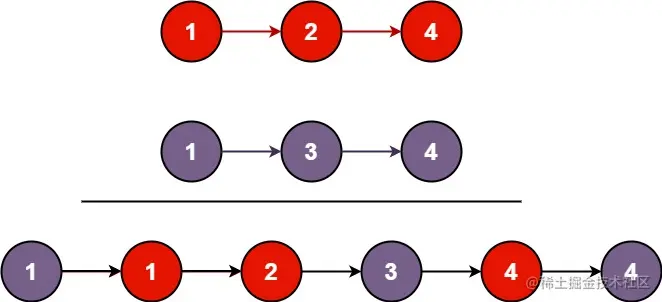
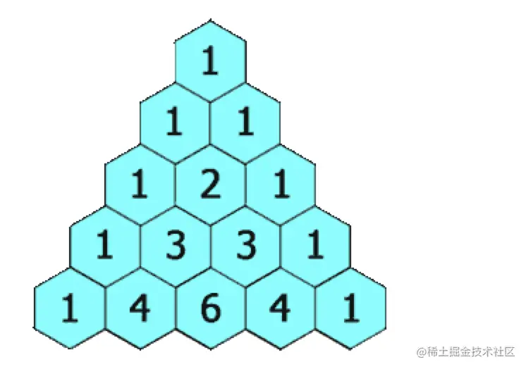
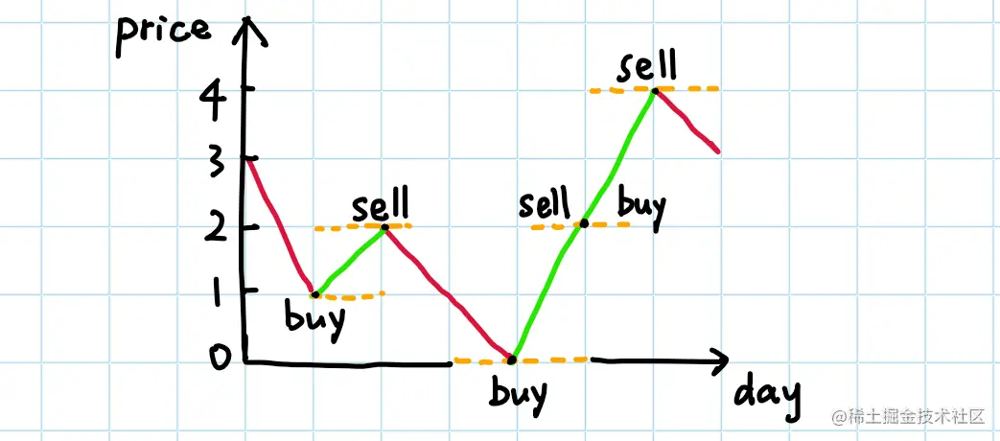
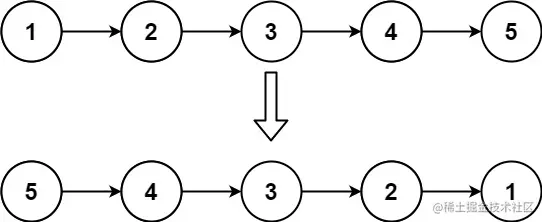
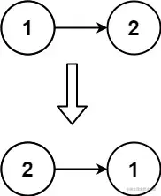
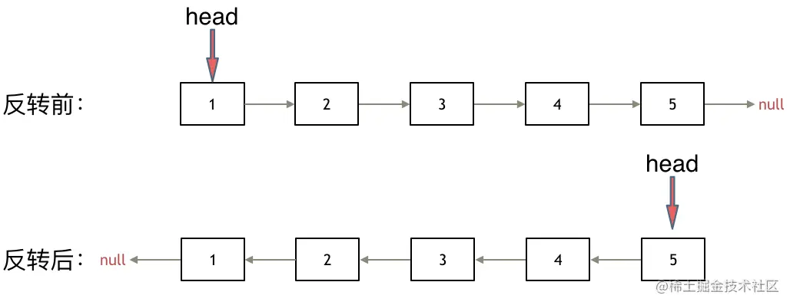
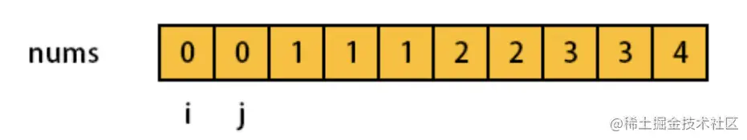

### 前言

本文题目选自   [LeetCode 精选 TOP 面试题](leetcode-cn.com/problem-list/2ckc81c/)，而这些题在自己和同事亲身经历中，确实遇到的几率在`百分之80%`以上（成都和北京的前端岗位）。本文挑选其中所有简单题做归类和解法分析。后续更新所有中等题分析。

为了帮助大家快速刷题，通过将`数据结构 + 题型`的方式总结出来，比如说`哈希表`拥有记数的功能，如果题目中包含字眼`至多xx次`， `至少xx次`,`唯一`等等字眼，可以联想到用哈希表来解决。刷个3-4道类似的题，就会养成一种条件反射。

## 举例：存在重复元素（类似题还有3道，后面一起说，解法一样）

题目描述如下：

给定一个整数数组，判断是否存在重复元素。

如果存在一值在数组中出现至少两次，函数返回 true 。如果数组中每个元素都不相同，则返回 false 。
```javascript
示例 1:

输入: [1,2,3,1]
输出: true

示例 2:

输入: [1,2,3,4]
输出: false
```

这题一看就是 计数问题，题目中`如果存在一值在数组中出现至少两次`，这句话就告诉我们记录每一个数字出现的次数就能解决问题了。

#### 解决思路：

我们遍历数组时，经过数组中的每一项就往map中添加，比如[1,2,3,1]
- 第一项：遍历到第一个1时，对象返回`{ 1: 1 }`,代表1出现1次
- 第二项：遍历到2时，返回 `{ 1: 1, 2: 1 }`
- 第三项：遍历到3时，返回 `{ 1: 1, 2: 1， 3: 1 }`
- 第四项：遍历到第二个1时，发现原来的对象里已经有1了，返回`false`

所以，代码自然也就出来了，如下：
```javascript
const containsDuplicate = function(nums) {
    let map = new Map();
    for(let i of nums){
        if(map.has(i)){
            return true;
        }else{
            map.set(i, 1);
        }
    }
    return false;
};
```

## 哈希表 + 计数类型

除了上面的那道题，在最热门的简单题型中还有一些记数类型的题，我们一一解答，这是一类题型

## 387. 字符串中的第一个唯一字符

一看题目，唯一，条件反射，记数题啊，map走起！我们先看一下题目：

给定一个字符串，找到它的第一个不重复的字符，并返回它的索引。如果不存在，则返回 -1。
```javascript
示例：

s = "leetcode"
返回 0

s = "loveleetcode"
返回 2
 
// 提示：你可以假定该字符串只包含小写字母
```
思路：
- 遍历字符串
- 用一个对象`{}`来记数，出现过一次就`+1`，
- - 遍历完毕，再次遍历字符串，看它们在之前记录的对象里的值，是否是1，是就返回下标，不是返回-1。

参考答案：
```javascript
var firstUniqChar = function(s) {
  const map = {};
  for(let v of s) map[v] = (map[v] || 0) + 1;
  for(let i = 0; i < s.length; i++) if(map[s[i]] === 1) return i;
  return -1;
};
```
## 242. 有效的字母异位词

我们先看一下题目：

给定两个字符串 s 和 t ，编写一个函数来判断 t 是否是 s 的字母异位词。

注意：若 s 和 t 中每个字符出现的次数都相同，则称 s 和 t 互为字母异位词。
 
```javascript
示例 1:

输入: s = "anagram", t = "nagaram"
输出: true
示例 2:

输入: s = "rat", t = "car"
输出: false
```
思路：这个题一看字眼，出现次数相同，次数不就是记数吗，记数题型，map走起！

- 声明计数器，一个对象 `const obj = {}`
- 遍历s字符串，如果遍历到字符串的`'a'`字母，去看`obj[a]`是否存在
- 不存在说明第一次遍历到`'a'`字母，那么初始化`obj[a] = 1`
- 如果存在则`obj[a] += 1`
- t字符串同理，它每次`减1`
- 遍历完s字符串后，遍历obj对象，看它的每一对`key：value`，是否`value`都是`0`

```javascript
var isAnagram = function(s, t) {

  const sLen = s.length;
  const tLen = t.length;
  if(sLen !== tLen ) {
      return false;
  }
  const obj = {};
  for(let i = 0 ; i < sLen ; i++){
      const currentS = s[i];
      const currentT = t[i];
      obj[currentS] ? obj[currentS]++ : obj[currentS] = 1;
      obj[currentT] ? obj[currentT]-- : obj[currentT] = -1;
  }
  return Object.values(obj).every(v=>v===0);
};
```
## 169. 多数元素

我们先看题目（题目里有次数两个字，又是记数题型，map继续走起）：

给定一个大小为 `n` 的数组，找到其中的多数元素。多数元素是指在数组中出现次数 大于 `⌊ n/2 ⌋` 的元素。

你可以假设数组是非空的，并且给定的数组总是存在多数元素。

```javascrpt
示例 1：

输入：[3,2,3]
输出：3
示例 2：

输入：[2,2,1,1,1,2,2]
输出：2
```

思路：
- 声明一个计数器,也就是一个对象`const map = {}`
- 遍历字符串，开始记数，如果字符串的字母第一次碰见，`map[第一次碰见的字母] = 1`
- 如果map已经记录过这个字母，则`map[记录过的的字母] += 1`
- 在遍历的过程中，看`map[记录过的的字母]` 是否大于 `数组总长度/2`

解答：

```javascript
var majorityElement = function(nums) {
  const map = {}
  const n = nums.length >> 1 // >>是右移运算符，意思是除以2
  for(let i = 0; i < nums.length; i++){
      map[nums[i]] = map[nums[i]] !== undefined ? map[nums[i]] + 1 : 1
      if(map[nums[i]] > n) return nums[i]
  }
}
```
## 只出现一次的数字

这个题一看，出现一次，map走起，但是呢，这个题比较巧的是，因为题目的一些限制条件，可以有更好的解法，我们先看题：

给定一个非空整数数组，除了某个元素只出现一次以外，其余每个元素均出现两次。找出那个只出现了一次的元素。

说明：

你的算法应该具有线性时间复杂度。 你可以不使用额外空间来实现吗？
```javascript
示例 1:

输入: [2,2,1]
输出: 1
示例 2:

输入: [4,1,2,1,2]
输出: 4
```
这里我们用`map`记录一遍，类似这样的代码，
```
const countMap = {};
数组.forEach((item)=> { countMap[item] ? countMap[item] += 1 : countMap[item] = 1 } )
最后再遍历一次countMap，然后看谁的次数是`1`，就解决了
```
但是这套题有另一个解法，用异或运算符，首先我们看看异或运算符有啥用：

异或运算符`(^)`，我们了解下，这个运算符的功能

- 任何数和自己做异或运算，结果为 `0`，即` a⊕a=0`。
- 任何数和` 0` 做异或运算，结果还是自己，即 `a⊕0=a`。
- 异或运算中，满足交换律和结合律，也就是`a⊕b⊕a=b⊕a⊕a=b⊕(a⊕a)=b⊕0=b`。

所以出现两次的字母异或运算得`0`，跟出现一次的字母异或运算得到自己

解答：
```javascript
var singleNumber = function(nums) {
  let init = nums[0];
  for(let i = 1; i < nums.length; i++){
      init ^=  nums[i];
  }
  return init;
};
```
## 位1的个数

编写一个函数，输入是一个无符号整数（以二进制串的形式），返回其二进制表达式中数字位数为 '1' 的个数（也被称为汉明重量）。

```JAVASCRIPT
示例 1：

输入：00000000000000000000000000001011
输出：3
解释：输入的二进制串 00000000000000000000000000001011 中，共有三位为 '1'。
示例 2：

输入：00000000000000000000000010000000
输出：1
解释：输入的二进制串 00000000000000000000000010000000 中，共有一位为 '1'。
```

思路：

计算个数，按照我们之前的思路，把整个数字转为字符串，类似这样：
```javascript
数字 0001 => String(0001) => '0001' => 遍历看1的个数
```
然后直接遍历计算就可以了，这是我为什么把它归为记数类别的原因，当然也可以把它归为数学类，我们用数学的算法来解，先看答案，我们再解析。

```javascript
var hammingWeight = function(n) {
    let ret = 0;
    while(n){
        n &= (n - 1);
        ret++;
    }
    return ret;
};
```
原理：

每执行一次`x = x & (x-1)`，会将`x`用二进制表示时最右边的一个`1`变为`0`，因为`x-1`将会将该位(`x`用二进制表示时最右边的一个`1`)变为`0`。因此，对 `x` 重复该操作，直到 `x` 变成 `0`，则操作次数即为 `x `的二进制数中的 `1` 的数目。

接下来，我们把其他类型的哈希表题也介绍了（相同的题型没那么多）
## 哈希表 + 映射功能

哈希表有一个非常常见的功能就是建立映射关系，比如说设计模式里的策略模式，思路是一样的，映射表常常见于后端的枚举类型，typescript也是一样，我们举一个js的例子

```typescript
// 后端只会返回0，1，2
const TYPE = {
    2: 'orange',
    1: 'red',
    0: 'blue'
}

// 然后前端会这样用
TYPE[后端返回的数字0或1或2]
```

### 对应的题有：

- 1.两数之和
- 349.两个数组的交集


## 两数之和

给定一个整数数组 nums 和一个整数目标值 target，请你在该数组中找出 和为目标值 target  的那 两个 整数，并返回它们的数组下标。

你可以假设每种输入只会对应一个答案。但是，数组中同一个元素在答案里不能重复出现。

你可以按任意顺序返回答案。

```javascript
示例 1：

输入：nums = [2,7,11,15], target = 9
输出：[0,1]
解释：因为 nums[0] + nums[1] == 9 ，返回 [0, 1] 。
示例 2：

输入：nums = [3,2,4], target = 6
输出：[1,2]
示例 3：

输入：nums = [3,3], target = 6
输出：[0,1]
```

用 hashMap 存储遍历过的元素和对应的索引。
每遍历一个元素，看看 hashMap 中是否存在满足要求的目标数字。
所有事情在一次遍历中完成（用了空间换取时间）

```JAVASCRIPT
var twoSum = function(nums, target) {
    const map = new Map();
    for(let i = 0, len = nums.length; i < len; i++){
        if(map.get(nums[i]) !== undefined){
            return [map.get(nums[i]), i];
        } else {
            map.set(target - nums[i], i);
        }
    }
    return [];
};
```

## 两数组交集

题目如下：
给定两个数组，编写一个函数来计算它们的交集。

```javascript
示例 1：

输入：nums1 = [1,2,2,1], nums2 = [2,2]
输出：[2]
示例 2：

输入：nums1 = [4,9,5], nums2 = [9,4,9,8,4]
输出：[9,4]
 

说明：

输出结果中的每个元素一定是唯一的。
我们可以不考虑输出结果的顺序。
```

这道题可以用set，很简单,但是空间复杂度和时间复杂度都太高，不太优雅
```javascript
var intersection = function (nums1, nums2) {
    return result =[...new Set(nums1)].filter(item=>new Set(nums2).has(item))
};
```

我们可以用map来做，时间和空间复杂度都低很多
思路：
- 用一个map去存nums1数组里的每一项，类似`map[nums1[i]] = true`
- 然后去遍历nums2，如果在map中已经有的值，类似`map[nums2[i]]`, 就把它push到一个数组里
- 并且将map[nums2[i]]设为false，后面有相同的值就不push到数组了

```javascript
var intersection = function(nums1, nums2) {
    const map = {};
    const ret = [];
    for(let i = 0; i < nums1.length; i++){
        map[nums1[i]] = true;
    }
    for(let i = 0; i < nums2.length; i++){
        if(map[nums2[i]]){
            ret.push(nums2[i])
            map[nums2[i]] = false
        }
    }
    return ret;
};
```
## 找规律题

这类题一般画个图或者稍微分析一下就能得出答案

## 13. 罗马数字转整数

这个题，我来简单描述一下，罗马数字对应我们阿拉伯数字的map如下：
```javascript
        I: 1,
        V: 5,
        IV: 4,
        IX: 9,
        X: 10,
        XL: 40,
        XC: 90,
        L: 50,
        C: 100,
        CD: 400,
        CM: 900,
        D: 500,
        M: 1000,
```
题目是给定一个罗马数字，将其转换成整数。输入确保在 1 到 3999 的范围内。
```javascript
示例 1:

输入: "III"
输出: 3
示例 2:

输入: "IV"
输出: 4
示例 3:

输入: "IX"
输出: 9
示例 4:

输入: "LVIII"
输出: 58
解释: L = 50, V= 5, III = 3.
```
解题思路就是我们发现这些案例的规律，就是把map表里面对应数字加起来就行了，比如说

`"LVIII"` = `'L'`（对应map表50）+ `'V'`（对应map表5）+ `'I'`（对应map表1） + `'I'`对应map表1） + `'I'`（对应map表1）

所以解答就很简单了，就是遍历数字把对应的值加起来，如下：
```javascript
var romanToInt = function(s) {
    const map = {
        I: 1,
        V: 5,
        IV: 4,
        IX: 9,
        X: 10,
        XL: 40,
        XC: 90,
        L: 50,
        C: 100,
        CD: 400,
        CM: 900,
        D: 500,
        M: 1000,
    }
    let res = 0;
    let index = 0;
    let len = s.length;
    while(index < len){
        if(index + 1 < len && map[s.slice(index, index+2)]){
            res += map[s.slice(index, index+2)];
            index += 2;
        }else{
            res += map[s.slice(index, index+1)];
            index += 1;
        }
    }
    return res;
};
```
## 14. 最长公共前缀
题目如下：

编写一个函数来查找字符串数组中的最长公共前缀。

如果不存在公共前缀，返回空字符串 ""。
```javascript
示例 1：

输入：strs = ["flower","flow","flight"]
输出："fl"
示例 2：

输入：strs = ["dog","racecar","car"]
输出：""
解释：输入不存在公共前缀。
 

提示：

0 <= strs.length <= 200
0 <= strs[i].length <= 200
strs[i] 仅由小写英文字母组成
```
思路：
这个题的思路就是，假如你求数组里3个元素的最长公共前缀
- 你先拿前两个比较，求出他们两个的最长公共前缀
- 然后上面求出的结果去跟第三个元素求最长公共前缀
- n个元素就一直这么`reduce`下去
```javascript
// 这个是求出两个元素最长公共前缀的方法
var longestCommonPrefix = function (strs) {
  if (strs.length === 0) return ''
  if (strs.length === 1) return strs[0];
  return strs.reduce(getSameStr, strs[0]);
};

function getSameStr(a, b) {
  let res = ''
  for (let j = 0; j < a.length; j++) {
    if (a[j] === b[j]) {
      res += a[j];
    } else {
      return res;
    }
  }
  return res
}
```
## 21. 合并两个有序链表

这个题简而言之就是看图找规律，就是合并为升序链表，具体题目如下：

我们先看一下题目：

将两个升序链表合并为一个新的 升序 链表并返回。新链表是通过拼接给定的两个链表的所有节点组成的。 


```javascript
示例 1：


输入：l1 = [1,2,4], l2 = [1,3,4]
输出：[1,1,2,3,4,4]
示例 2：

输入：l1 = [], l2 = []
输出：[]
示例 3：

输入：l1 = [], l2 = [0]
输出：[0]
 

提示：

两个链表的节点数目范围是 [0, 50]
-100 <= Node.val <= 100
l1 和 l2 均按 非递减顺序 排列
```
思路:

那就挨个遍历，按顺序谁小拼接谁，接着进入下一轮循环，看代码更清晰一些：

```javaScript
// 链表定义函数
function ListNode(val, next) {
    this.val = (val===undefined ? 0 : val)
    this.next = (next===undefined ? null : next)
}

var mergeTwoLists = function(l1, l2) {
  const dummpy = node = new ListNode();
  while(l1 && l2){
      if(l1.val >= l2.val){
          node.next = l2;
          node = node.next;
          l2 = l2.next;
      } else {
          node.next = l1;
          node = node.next;
          l1 = l1.next;
      }
  }
  node.next = l1 || l2;
  return dummpy.next;
};
```

## 28. 实现str（）

题目如下：

实现 `strStr()` 函数。

给你两个字符串 `haystack` 和 `needle` ，请你在 `haystack` 字符串中找出 `needle` 字符串出现的第一个位置（下标从 `0` 开始）。如果不存在，则返回  `-1` 。
 
```JAVASCRIPT
示例 1：

输入：haystack = "hello", needle = "ll"
输出：2
示例 2：

输入：haystack = "aaaaa", needle = "bba"
输出：-1
示例 3：

输入：haystack = "", needle = ""
输出：0
 

提示：

0 <= haystack.length, needle.length <= 5 * 104
haystack 和 needle 仅由小写英文字符组成
```

思路：

本来这道题最佳算法是KMP，这个算法理解起来对我来说有难度，所以自己换了另一种思路

- 遍历字符串看是否有和需要找的字符串第一个字母相同
- 如果相同，就截取字符串跟需要找的字符串相同长度的字符串对比
- 相同就返回下标，不同就继续遍历原字符串

```javascript
var strStr = function (haystack, needle) {
  if (needle === "") return 0
  for (var i = 0; i < haystack.length; i++) {
      if (haystack[i] === needle[0]) {
          if (haystack.substring(i, i + needle.length) === needle) return i;
      }
  }
  return -1
};
```
## 118. 杨辉三角

这个可是找规律的代表题，并且这道题可以训练一下你对`二维数组` 转化为 `代码`的能力：


给定一个非负整数 *numRows，* 生成杨辉三角的前 *numRows* 行。




在杨辉三角中，每个数是它左上方和右上方的数的和。

**示例:**

```javascript
输入: 5
输出:
[
     [1],
    [1,1],
   [1,2,1],
  [1,3,3,1],
 [1,4,6,4,1]
]
```
思路：
- 看到上图可以发现，生成杨辉三角`numRows`行，数组就有`numRows`行
- 每一行，它的数组第一个位置和最后一个位置都是`1`
- 每一行，除了第一个和最后一个位置，其它位置的值`等于上一行的两个值相加`

把思路翻译成代码即可：

```javascript
var generate = function(numRows) {
  if(numRows === 0){ return [] }
  const result = Array.from(new Array(numRows), ()=>[])
  for(let i = 0; i < numRows; i++){
    result[i][0] = 1; result[i][i] = 1;
      for(let j = 1; j < i; j++){
      result[i][j] = result[i-1][j-1] + result[i-1][j] 
    }
  }
return result
};
```

## 121. 买卖股票的最佳时机

接下来这道题，你简单看下题目就行，解答原理超级简单，看图说话，找规律！


我们先看题：

给定一个数组 `prices` ，它的第 `i` 个元素 `prices[i]` 表示一支给定股票第 `i` 天的价格。

你只能选择 `某一天 买入这只股票，并选择在 未来的某一个不同的日子` 卖出该股票。设计一个算法来计算你所能获取的最大利润。

返回你可以从这笔交易中获取的最大利润。如果你不能获取任何利润，返回 0 。

```javascript
示例 1：

输入：[7,1,5,3,6,4]
输出：5
解释：在第 2 天（股票价格 = 1）的时候买入，在第 5 天（股票价格 = 6）的时候卖出，最大利润 = 6-1 = 5 。
     注意利润不能是 7-1 = 6, 因为卖出价格需要大于买入价格；同时，你不能在买入前卖出股票。
示例 2：

输入：prices = [7,6,4,3,1]
输出：0
解释：在这种情况下, 没有交易完成, 所以最大利润为 0。
 

提示：

1 <= prices.length <= 105
0 <= prices[i] <= 104
```
解题思路： 我们先看一张图，假设给定的数组为：`[7, 1, 5, 3, 6, 4]`




- 第一天是7，我们记录一下，因为还没到第二天不知道这个价格是高是低，`标记最小值是7`
- 第二天是1，`比7小`，那么只要当前天数的值比前面小，就说明不卖，因为它是最小值，`标记最小值是7`
- 第三天是5，5比前一天大，说明比最小值要大，那么可以卖，利润就是`5-1=4`
- 第四天发现是3，比5小，还是一样的道理，比之前小，最小值就要变为当前值，啥也不干，`标记最小值是3`
- 第五天发现是6...，第六天发现是4，规律是一样的

意思是只要今天比昨天低，就可以用今天的减去最小值，就是利润，然后每次都比较这个利润是不是最大就行了

结合一下代码，就会清楚

```JAVASCRIPT
var maxProfit = function(prices) {
  let res = 0;
  let min = prices[0];
  for(let i = 1; i < prices.length; i++){
      if(prices[i] < min){
          min = prices[i]
      } else {
          res = Math.max(res, prices[i] - min)
      }   
  }
  return res;
};
```

## 122. 买卖股票的最佳时机2

又来一道看图说话题目，简单！走起！

先看题目：

给定一个数组 `prices` ，其中 `prices[i]` 是一支给定股票第 `i` 天的价格。

设计一个算法来计算你所能获取的最大利润。你可以尽可能地完成更多的交易（多次买卖一支股票）。

注意：你不能同时参与多笔交易（你必须在再次购买前出售掉之前的股票）。
 
```javascript
示例 1:

输入: prices = [7,1,5,3,6,4]
输出: 7
解释: 在第 2 天（股票价格 = 1）的时候买入，在第 3 天（股票价格 = 5）的时候卖出, 这笔交易所能获得利润 = 5-1 = 4 。
     随后，在第 4 天（股票价格 = 3）的时候买入，在第 5 天（股票价格 = 6）的时候卖出, 这笔交易所能获得利润 = 6-3 = 3 。
示例 2:

输入: prices = [1,2,3,4,5]
输出: 4
解释: 在第 1 天（股票价格 = 1）的时候买入，在第 5 天 （股票价格 = 5）的时候卖出, 这笔交易所能获得利润 = 5-1 = 4 。
     注意你不能在第 1 天和第 2 天接连购买股票，之后再将它们卖出。因为这样属于同时参与了多笔交易，你必须在再次购买前出售掉之前的股票。
示例 3:

输入: prices = [7,6,4,3,1]
输出: 0
解释: 在这种情况下, 没有交易完成, 所以最大利润为 0。
```

思路，看图马上思路就出来了：


我们的利润就跟上图绿色部分显示的一样，也就是说只要今天减去昨天，是正数就是利润，简单吧，哈哈！

```javascript
var maxProfit = function(prices) {
  let result = 0
  for(let i = 1; i < prices.length; i++){
      if(prices[i] > prices[i-1]){
          result += prices[i] - prices[i - 1]
      }
  }
  return result
};
```

## 206. 反转链表

这个题必须掌握牢实，是解很多链接表题的基础的基础。先看题目：

给你单链表的头节点 head ，请你反转链表，并返回反转后的链表。
 

示例 1：



```javascript
输入：head = [1,2,3,4,5]
输出：[5,4,3,2,1]
```
示例 2：



```javascript
输入：head = [1,2]
输出：[2,1]
```

解题思路依然是看图找规律，下图就是，我们把链表前面加一个null，这样翻转前和翻转后就一致了。

解答：

```javascript
var reverseList = function(head) {
  let [pre, node] = [null, head];
  while(node){
      const temp = node.next;
      node.next = pre;
      pre = node;
      node = temp;
  }
  return pre;
};
```
## 双指针

双指针是解数组类型题最常见解法
- 比如有头尾分别有指针，然后依次向中间靠拢的双指针，
- 还有一种是快慢是指针，两个指针都是从左边开始，一个走的快，一个走得慢

具体的细节还是需要从题里体会，我们现在就开始！


## 26. 删除数组中的重复项


先看一下题目：


给你一个有序数组 `nums` ，请你 原地 删除重复出现的元素，使每个元素 只出现一次 ，返回删除后数组的新长度。

不要使用额外的数组空间，你必须在 原地 修改输入数组 并在使用 O(1) 额外空间的条件下完成。


```javascript
示例 1：

输入：nums = [1,1,2]
输出：2, nums = [1,2]
解释：函数应该返回新的长度 2 ，并且原数组 nums 的前两个元素被修改为 1, 2 。不需要考虑数组中超出新长度后面的元素。
示例 2：

输入：nums = [0,0,1,1,1,2,2,3,3,4]
输出：5, nums = [0,1,2,3,4]
解释：函数应该返回新的长度 5 ， 并且原数组 nums 的前五个元素被修改为 0, 1, 2, 3, 4 。不需要考虑数组中超出新长度后面的元素。
 

提示：

0 <= nums.length <= 3 * 104
-104 <= nums[i] <= 104
nums 已按升序排列
```
初始状态是：


- 慢指针是`i`，快指针是`j`
- 如果`nums[i]` 等于 `nums[j]` 说明是相同的元素，`j`继续走，`i`还在原位
-  如果`nums[i]` 不等于 `nums[j]` 说明是不相同的元素，那么`nums[i++] = nums[j]`，`j`继续向前走

依次类推，就相当于`i`指针保证它和它前面的数字都是不重复的，`j`就是一个遍历器

```JAVASCRIT
var removeDuplicates = function(nums) {
  let i = 0;
  for(let j = 1; j < nums.length; j++){
      if(nums[j] !== nums[i]){
          nums[i+1] = nums[j];
          i++
      }
  }
  return i + 1
};
```
## 88. 合并两个有序数组

我们先看题目：

给你两个有序整数数组 `nums1` 和 `nums2`，请你将 `nums2` 合并到 `nums1` 中，使 `nums1` 成为一个有序数组。

初始化 nums1 和 nums2 的元素数量分别为 m 和 n 。你可以假设 nums1 的空间大小等于 m + n，这样它就有足够的空间保存来自 nums2 的元素。
 
```
示例 1：

输入：nums1 = [1,2,3,0,0,0], m = 3, nums2 = [2,5,6], n = 3
输出：[1,2,2,3,5,6]
示例 2：

输入：nums1 = [1], m = 1, nums2 = [], n = 0
输出：[1]
 

提示：

nums1.length == m + n
nums2.length == n
0 <= m, n <= 200
1 <= m + n <= 200
-109 <= nums1[i], nums2[i] <= 109
```
这道题大家很容易想到，新创建一个数组，然后分别比较这两个数组里的每一项，push进去就行了

然而因为是有序数组，第一个数组还有正好满足假如第二数组的空间，所以这里可以采取双指针来解答，从后往前遍历

参考如下：
```javascript
var merge = function (nums1, m, nums2, n) {
  let len = m + n - 1;
  m--, n--;
  while (m >= 0 && n >= 0) {
    if (nums1[m] > nums2[n]) {
      nums1[len] = nums1[m--]
    } else {
      nums1[len] = nums2[n--]
    }
    len--;
  }
  if(m === -1){
    return nums1.splice(0, len+1, ...nums2.slice(0, n + 1));
  }
  if(n === -1){
    return nums1;
  }
};
```
## 125. 验证回文串

请看题目：

给定一个字符串，验证它是否是回文串，只考虑字母和数字字符，可以忽略字母的大小写。

说明：本题中，我们将空字符串定义为有效的回文串。

```JAVASCRIPT
示例 1:

输入: "A man, a plan, a canal: Panama"
输出: true
解释："amanaplanacanalpanama" 是回文串
示例 2:

输入: "race a car"
输出: false
解释："raceacar" 不是回文串
```
这个题太简单了，以至于不用写思路了，看代码就知道，就是用用双指针头尾向中间靠拢的解法，

```javascript
var isPalindrome = function(s) {
  s = s.replace(/[^\w]/g, '').toLowerCase();
  let leftPointer = 0;
  let rightPointer = s.length - 1;
  while(rightPointer > leftPointer){
      if(s[leftPointer++] === s[rightPointer--]){
          continue;
      }else{
          return false;
      }
  }
  return true;
};
```

## 234. 回文链表

这个题思路跟上面是一样的，都是双指针对比，但是主要这个题写起来很麻烦，要用到我们之前说的翻转链表，

解题思路：
- 先用快慢指针的手法，让我们知道这个链表的中点是哪，然后从中点截断
- 然后截断成为两个链表，把后面的链表翻转
- 最后依次去判断这两个链表每一项是否相同

关键点：如何从中点截断这个链表,方法如下，让一个指针每次走一步，另一个指针每次走两步，这样他们每次走的倍数就相差2倍。代码如下：

```javascript
  let fast = head;
  let slow = head;
  let prev;
  while (fast && fast.next) {
    prev = slow;
    slow = slow.next;
    fast = fast.next.next;
  }
prev.next = null;  // 断成两个链表
```
- 接着我们需要翻转链表

```javascript
 // 翻转后半段
  let head2 = null;
  while (slow) {
    const tmp = slow.next;
    slow.next = head2;
    head2 = slow;
    slow = tmp;
  }
```

- 最后对比就看下面具体代码了

```javascript
const isPalindrome = (head) => {
  if (head == null || head.next == null) {
    return true;
  }
  let fast = head;
  let slow = head;
  let prev;
  while (fast && fast.next) {
    prev = slow;
    slow = slow.next;
    fast = fast.next.next;
  }
  prev.next = null;  // 断成两个链表
  // 翻转后半段
  let head2 = null;
  while (slow) {
    const tmp = slow.next;
    slow.next = head2;
    head2 = slow;
    slow = tmp;
  }
  // 比对
  while (head && head2) {
    if (head.val != head2.val) {
      return false;
    }
    head = head.next;
    head2 = head2.next;
  }
  return true;
};
```
## 237. 删除链表中的节点

题目如下：

请编写一个函数，使其可以删除某个链表中给定的（非末尾）节点。传入函数的唯一参数为 要被删除的节点 。

现有一个链表 -- head = [4,5,1,9]，它可以表示为:


```javascript
示例 1：

输入：head = [4,5,1,9], node = 5
输出：[4,1,9]
解释：给定你链表中值为 5 的第二个节点，那么在调用了你的函数之后，该链表应变为 4 -> 1 -> 9.
示例 2：

输入：head = [4,5,1,9], node = 1
输出：[4,5,9]
解释：给定你链表中值为 1 的第三个节点，那么在调用了你的函数之后，该链表应变为 4 -> 5 -> 9.
 

提示：

链表至少包含两个节点。
链表中所有节点的值都是唯一的。
给定的节点为非末尾节点并且一定是链表中的一个有效节点。
不要从你的函数中返回任何结果。
```
这个题很简单，其实这个node是个引用类型，你只需要把node的val变为node.next的val，然后node的next指向node.next.next，就移花接木，完成任务了！自己可以试着在草稿上画一下，结合代码很快就会明白！

```JAVASCRIPT
var deleteNode = function(node) {
  node.val = node.next.val
  node.next = node.next.next
};
```


## 283. 移动零

题目如下：
给定一个数组 nums，编写一个函数将所有 0 移动到数组的末尾，同时保持非零元素的相对顺序。

```JAVASCRIPT
示例:

输入: [0,1,0,3,12]
输出: [1,3,12,0,0]
说明:

必须在原数组上操作，不能拷贝额外的数组。
尽量减少操作次数。
```
如动画所示，我们可以用快慢指针来解答，具体不好用语言叙述，看动图


```javascript
var moveZeroes = function(nums) {
  let i = j = 0;
  while(i < nums.length) {
      if(nums[i] !== 0){
          [nums[i], nums[j]] = [nums[j], nums[i]]
          j++
      }
      i++
  }

  return nums
};
```

## 344. 反转字符串 

题目如下：

编写一个函数，其作用是将输入的字符串反转过来。输入字符串以字符数组 char[] 的形式给出。

不要给另外的数组分配额外的空间，你必须原地修改输入数组、使用 O(1) 的额外空间解决这一问题。

你可以假设数组中的所有字符都是 ASCII 码表中的可打印字符。

```
示例 1：

输入：["h","e","l","l","o"]
输出：["o","l","l","e","h"]
示例 2：

输入：["H","a","n","n","a","h"]
输出：["h","a","n","n","a","H"]
```

这个题目实在太简单了，知道用首位双指针即可，看参考：

```javascript
var reverseString = function(s) {
  let l = 0 ;
  let r = s.length - 1;
  while(l < r){
    [s[l], s[r]] = [s[r], s[l]];
    l++; r--;
  }
  return s;
};
```
## 350. 两个数组的交集II

题目如下：
给定两个数组，编写一个函数来计算它们的交集。

 
```javascript
示例 1：

输入：nums1 = [1,2,2,1], nums2 = [2,2]
输出：[2,2]
示例 2:

输入：nums1 = [4,9,5], nums2 = [9,4,9,8,4]
输出：[4,9]

说明：

输出结果中每个元素出现的次数，应与元素在两个数组中出现次数的最小值一致。
我们可以不考虑输出结果的顺序。

```
这个取交集需要保留重复元素，可以是用双指针来解答，具体思路和代码如下

- 如果两个数组是有序的，则可以使用双指针的方法得到两个数组的交集。

- 首先对两个数组进行排序，然后使用两个指针遍历两个数组。

- 初始时，两个指针分别指向两个数组的头部。每次比较两个指针指向的两个数组中的数字，如果两个数字不相等，则将指向较小数字的指针右移一位，如果两个数字相等，将该数字添加到答案，并将两个指针都右移一位。当至少有一个指针超出数组范围时，遍历结束


```javascript

var intersect = function(nums1, nums2) {
  nums1 = nums1.sort((a, b) => a - b);
  nums2 = nums2.sort((a, b) => a - b);
  let l1 = 0;
  let l2 = 0;
  const nums1Len = nums1.length;
  const nums2Len = nums2.length;
  const ret = [];
  while(l1 < nums1Len && l2 < nums2Len){
    if(nums1[l1] === nums2[l2]){
      ret.push(nums1[l1]);
      l1++;
      l2++;
    }
    if(nums1[l1] > nums2[l2]) l2++;
    if(nums1[l1] < nums2[l2]) l1++;
  }
  return ret;
};
```

剩下20道题的分类和解答应该明后天写完，后续包括

- 栈
- 动态规划
- 数学问题
- 环问题
