# 【前端的后端知识体系】- 操作系统 - 面试题篇

hello，我是孟祥同学，本文尽量避免枯燥的说教，力图通过前端日常工作 + js写的代码，引出学习操作系统的知识的面试题。最终希望大家都可以在自己的简历上加上一条技能，既 熟悉并理解操作系统的基本概念，并能用于理解一些常见的前端操作。

这部分知识对于纯前端开发来说可能没有那么重要，但是如果你要涉及到后端开发，包括运维，不了解操作系统的一些基本知识会让你很容易陷入用api都不会用，因为很多知识已经完全超出你的认知。以至于面试的时候，很简单的问题都会问的你脑袋懵懵的。

比如字节node.js面试题有问到:node.js中的多进程有什么优缺点？如何传递信息？腾讯的面试直接问你，进程，线程，协程的区别是什么？

你没有操作系统的基础，这些题肯定答不上来，网上很多答案本身就是错的或者写的较为浅，这是你不得不学操作系统的最现实的原因。

还有以下描述，可能很多前端完全看不懂，但这其实是很基础的知识。举个例子，在linux系统中，node.js中进程间通信使用了 domain socket（不理解没关系），其中一个很重要的原因就是 domain socket 能传递文件描述符。文件描述符传递是一个非常重要的能力。在操作系统中，当进程打开一个文件的时候，进程的文件描述符表会被继承。但是如果主进程在fork子进程之后，打开了一个文件，他想告诉子进程，那怎么办呢？这时必须要把文件描述符也一起传过去，仅仅传fd（也就是数字）是不行的。

至于为什么不行，我们需要了解文件信息，文件描述符，磁盘数据之间的关系。要不上面的举例你跟听天书一样，完全不知道是什么意思。同时，当你面试的时候谈到Node.js的进程间通信也可以侃侃而谈，比其他面试者答的更出色。

**我跟很多写教程的人不一样，我相信扎实的基础一定是需要耐心和时间沉淀，不是简简单单那看一片文章，一本小册就能速成的！**

注：【前端的后端体系小册】在不断更新中，包括从计算机基础理论 -> linux基础 -> node.js -> 数据库(mysql + redis) nest项目 -> docker -> k8s 全链路知识点的入门 + 高级篇（主要是参考了很多付费课程和国内外的文章提炼而成，入群交流微信：a2298613245）。<br />顺便推广一下我的[react组件库教程]([lio-mengxiang.github.io](https://lio-mengxiang.github.io/mx-design/#/components/button))，如果对你有帮助，感谢star，也欢迎进群交流。<br />本系列文章未经过本人允许，禁止转载
## 从开机开始
首先，我们开机的时候，启动的是操作系统。可是你有没有想过，操作系统也是软件，运行软件都是要把程序装载到内存，才能被cpu调度的。<br />所以我们要启动操作系统，是需要把启动程序从硬盘读取到内存才可以被cpu执行的。<br />这里就有问题了: 
## 为什么要把程序代码读到内存才能执行？直接读取硬盘数据执行不行吗？
原因是首先因为磁盘读取速度太慢了，cpu执行速度太快，所以应用程序需要加载到读取速度更快的物理介质中。

然后，你可能会问为什么不把所有程序都装在内存里呢？就不用从磁盘把程序读到内存了啊。这里又涉及到一个知识点，就是数据存储器分为RAM和ROM。 RAM 代表随机存取内存，特点是掉电数据就没了。ROM 代表只读内存，掉电还能保存数据，比如硬盘。

而且，内存的容量相比硬盘要小非常非常多，所以把程序都读到硬盘不现实。<br />最终，通过一系列操作（详细过程会在第一章结束会详细描述）读取到启动操作系统的程序，然后cpu执行这由这个程序帮助我们完成开机操作。

额外小知识：一般启动的时候会短促有 “嘀”的一声，这是BIOS硬件自检通过的标志（简单理解硬件自检就是，启动电脑，硬盘、内存、cpu等这些硬件是否能正常工作，比如你硬盘都没了，你咋加载操作系统软件呢，更别谈开机了）。

开机后，我们找到自己的前端项目，准备开始今天的任务，一般都是打开代码编辑器，比如vscode，此时vscode将我们的存放代码加载进来，此时又有问题了
## 我们的代码，也就是文件是如何从硬盘加载到内存？
我要加载文件，按道理来说，我直接去操作系统的磁盘里找到这个文件就行了，可现实却不是这样的。

无论windows还是mac，都是可以多人用自己的账号登录，那么有可能我的文件我并不想让别的用户访问，所以打开文件我们不能直接打开，起码要看看你有没有打开的权限。

所以当我们打开文件的时候首先是去某个地方看这些权限信息，保存这些信息的地方我们可以简单的称之为文件控制块，这些信息应该存储在硬盘里，因为现实中即使你关机了，这些权限在开机后还在。并且因为目录访问是非常频繁的，一般开机的时候，文件控制块表就已经加载到内存了。<br />问题又来了？
## 文件控制块中保存了哪些信息帮助我们去找文件呢？
回答这个问题之前，我们需要先介绍一下保存文件的物理存储设备 - 磁盘（我们逻辑上的数据块映射到物理设备磁盘叫扇区），理解了它，才能帮助我们解答这个问题。

首先磁盘是块设备，什么意思呢？就是读取信息的时候并不是一个字节一个字节读取，而是一整块一整块的读取，我们假设每个块大小是512kb。

这里有要引申出一个问题，数据块我们一般都是逻辑上的叫法，真实映射到物理磁盘上，我们称之为扇区，什么是扇区呢？
## 这里我们不得不来看看磁盘的物理结构了

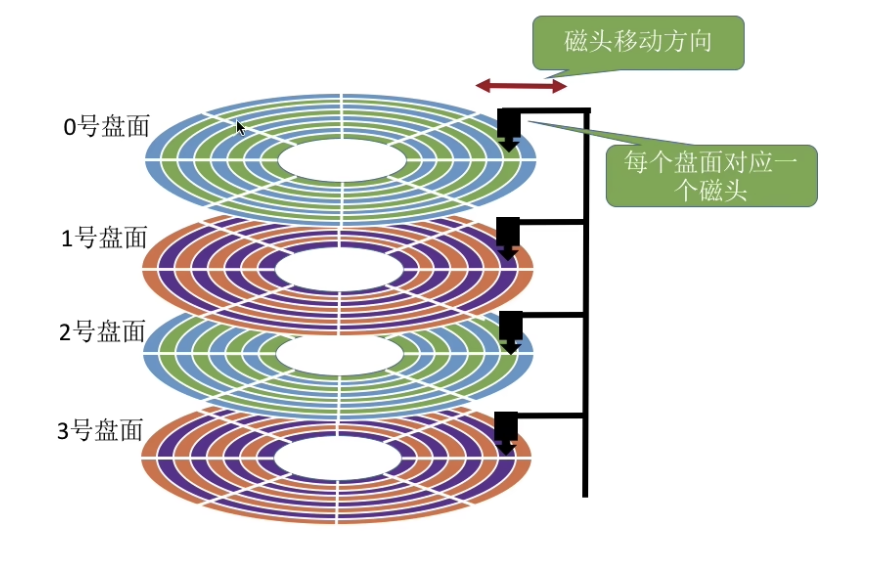

<br />上面的是黑色部分，分别是磁头和磁臂，然后磁头读取盘面上的信息。然后磁盘上会有扇区划分，如下图：<br />

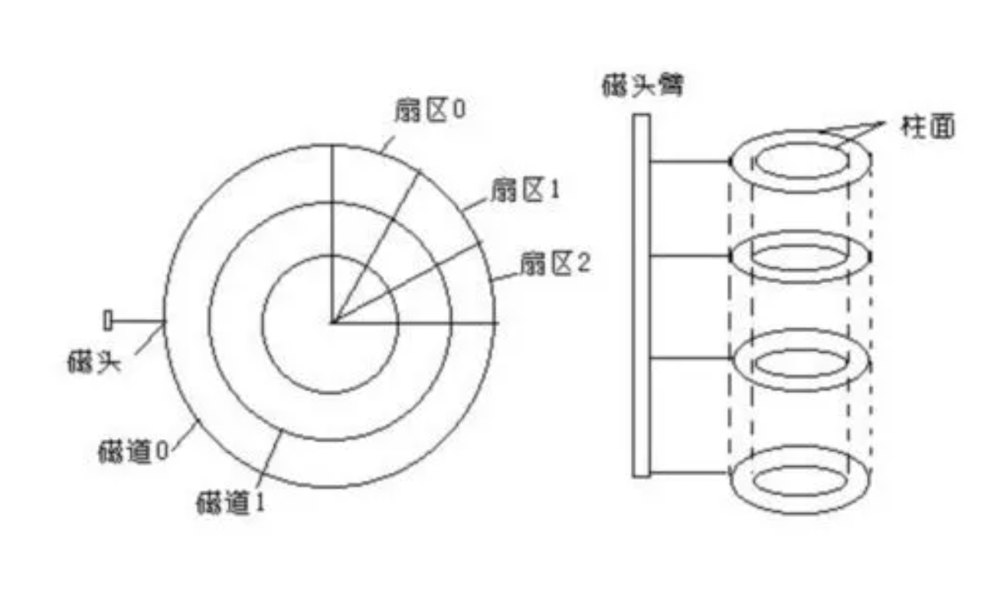

<br />上面可以看到，一个盘面被划分为多个相等的扇区。然后我们可以给扇区编上号，这样当我们要查找某个文件的时候，操作系统会指名这个文件在几号数据块上，数据块又映射到物理上的扇区上，将真正的数据提取到内存中供CPU调度。

所以回到上面的问题：文件控制块中保存了哪些信息帮助我们去找文件呢？肯定要包含数据块的信息，比如文件存放到1号数据块里，这样操作系统内部在映射到磁盘扇区上。

我们可以再想想，文件控制块中保存的文件信息，起码要有文件名对吧，我们就是靠文件名去目录表里搜索到底是哪个文件的，当然还有我们之前提到的权限，就是权限信息，例如你有可读，可写，还是可以执行的文件的权限。文件大小，文件路径是不是按道理也需要。

我们在命令行可以输入，ls -l命令，就可以看到目录的详细信息。如下图<br />

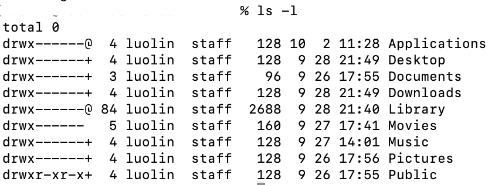

<br />简而言之，这些保存的文件信息和控制信息，我们称之为FCB，文件控制块（file control block）。在linux中，又被称之为inode表（linux中的存储文件目录的方式是索引分配，比FCB更高级），inode指的是index node，也就是索引节点的意思。

这就回答了上面的问题，就是数据如何从磁盘读取到内存，其实因为磁盘读取速度比较慢，一般磁盘的数据会存储到一个缓存缓冲区里，然后缓冲区再存到内存里（意思是我先读一大块数据，然后写入内存，而不是一点点的读取，这就是缓冲区的意义），缓冲区对于我们理解node.js中流的使用至关重要，这个在我的node.js 教程中会深入stream的js源码探索。(更详细的文件打开流程，后面会详述)

文件加载进去了，此时，我们前端需要新建一个组件，我们就打开代码编辑器，在里面通过GUI（也就是可视化界面）来创建一个新文件。

此时，又有几个问题来了，首先，你创建新文件其实是需要将新文件创建的基本信息存放到目录表里，还有就在磁盘里给这个文件划分使用的扇区。那么你怎么知道扇区里那些地方有空闲的磁盘块呢？
## 如何知道哪里有空闲的磁盘块呢？
其实操作系统会在你格式化的文件系统里，有一部分存储空间专门存储空闲磁盘块有哪些的信息。

例如空间磁盘块的管理方法有一种叫bit map（位图）。

也就是说假如有我们实际上只有4个数据块可以使用，bit map就存储了 0000，这4个比特位，4对应了4个数据块，0代表着目前4个数据块都是没有使用的，1代表使用了。

这样的管理方式有什么缺点呢，就是我们要扫瞄一遍才能知道有哪个空闲块，优点是标识数据块已经有数据和没有数据非常方便，只要改下0或者1就行了。

所以还有一些其他管理方式，比如链表法，把每个空闲块用链表的方式存储起来，这样查找空闲块就很方便，从链表头部就知道哪些是空闲的。这些方法各有优缺点，不同的文件系统选择不同的管理方式。

到此为止，我们大概介绍了一下操作系统的文件管理，最最重要的知识点是要理解进程描述符表，系统级打开文件表和inode表之间的关系，作为进阶内容，会在本章的"总结"详细描述。

好了，创建好文件之后，你有没有想过，我们存放的代码文件在内存里是如何存放的呢？

有人会说了，这还不简单，连续存放的呗，比如我有一个js文件，可能比较大，占据数据块1号和2号，存放的时候，直接1号和2号存到物理扇区里。

但是你有没有想过，假如一个文件A占据10个数据块，另一个文件B也占10个数据块，它们是挨着的，如下：
```
A文件占据的数据块 | B文件占据的数据块 ｜ C文件占据的数据块
```
那么问题来了，A文件变大了，那么为了给A文件提供更多连续的存储空间，不得不把b，c文件数据块往后移，这就可怕了，数据文件多了，这种文件管理方式的弊端就非常明显了。

但是如果你的文件都是只读的，不能写，其实这种方式也可以。

也就是说，实际上落到磁盘的数据，如果物理上都要求连续存储，其实使用场景是非常有限的，所以我们需要一种非连续分配的方式，我这里直接说一下现代操作系统常用的一种方式吧，就是索引分配<br />

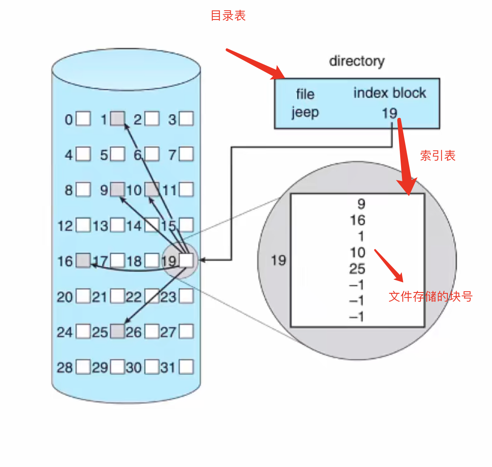

<br />这里可以看到，目录表，一般条目里包含存放的是这个文件存储的物理块号在哪里，但索引分配存储的是索引表的地址，在索引表上存储里对应物理块号的哪一个。（还有多级索引表，这里不引申了）

例如，当创建一个文件时，系统会为其建立一个索引表，其中所有的盘块号设置为null。首次写入第i块时，先从空闲表块中取出一块，然后将其地址（即物理块号）写入到索引表的i项中。

它的优点是什么，我们可以进行随机访问，因为存储索引的数据结构在linux的ext4系统里是b树，b树支持随机查找。B树示意图如下（这个不深究了，请看我的mysql高级篇，会讲解B-Tree和B+Tree的区别）。<br />

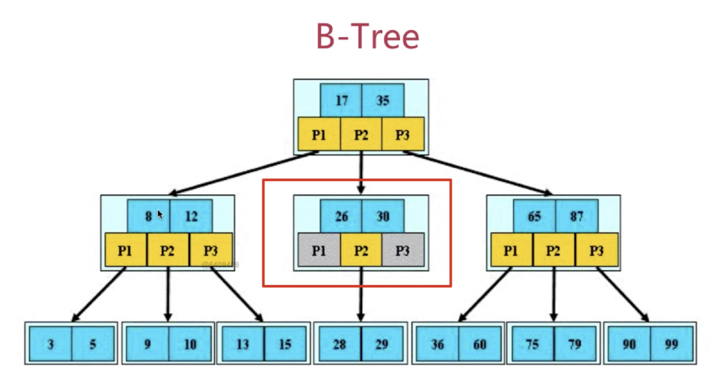

<br />最后我们补充一下文件打开的知识：
## 文件描述符，i-node表，数据存储间的关系
我们先介绍几个关键信息，系统为维护文件描述符，建立了三个表：

- 进程级的文件描述符表
- 系统级的文件描述符表
- 文件系统的i-node表

他们的关系如下图（图片来自网络）：<br />

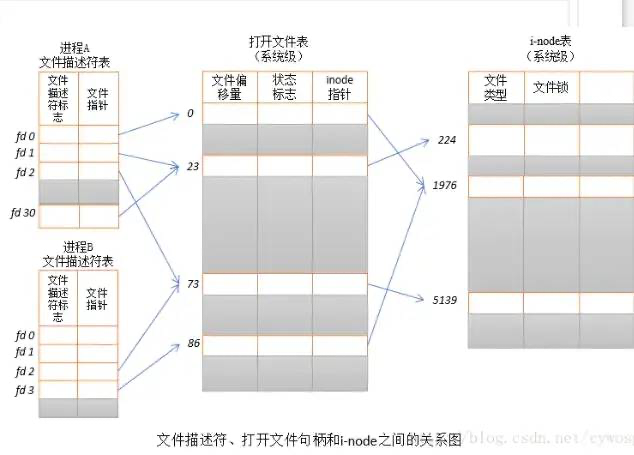

<br />每一个进程都维护了一个自己打开哪些文件的表，叫做进程级文件描述符表，例如，在node.js中，调用fs模块的open方法，会返回一个文件描述符，如上图最左侧，文件描述是操作文件很关键的一个凭证，其实它在知识进程打开表的一个索引而已。

操作系统为每一个进程维护了一个文件描述符表，该表的索引值都从从0开始的，所以在不同的进程中可以看到相同的文件描述符，但是否指向同一个文件就不一定了。然后在系统级文件打开表中找到inode指针，最后通过inode指针找到inode表。

注意的是inode表中有我们之前介绍的索引链接，索引链接在inode中存储了文件数据块的地址信息，从而找到所有数据块来还原整个文件。

其实这一部分主要想介绍的就是文件系统，接下来我们用一个完整案例，来把上面的知识串到一起。
## 本章总结：开机加载数据的过程
首先，磁盘最开始什么都没有，卖磁盘的厂家会先对磁盘进行低级格式化，也就是划分扇区：<br />

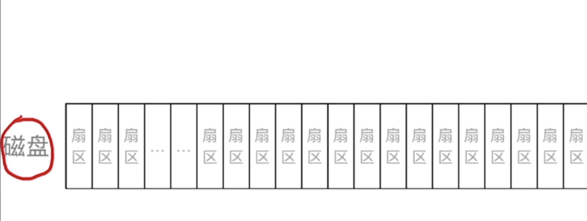

<br />然后装操作系统的过程，会对磁盘进行高级格式化，高级格式化主要目的是在磁盘上装载文件系统，同时会安装引导操作系统启动的引导程序。

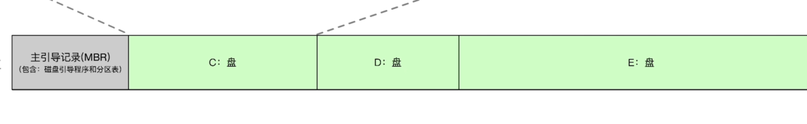

<br />可以看到，在第一个扇区，存放着主引导记录，主要包含了磁盘引导程序和分区表。分区表不用说了，这个大家能理解，尤其是windows，我们划分为c盘，d盘什么的。磁盘引导程序一个主要作用就是扫描分区，然后执行主分区里引导程序，在windows一下一般都是c盘，linux则是情况而定。如下：

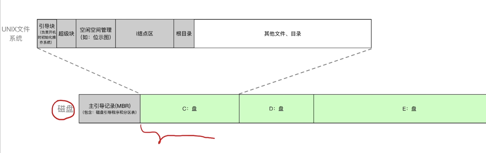

<br />然后执行主分区里的系统初始化程序，完成“开机”等一系列动作。

上图可以看到，c盘里的第二个灰色块是超级块，简单来说就是存放硬盘已用空间、数据块可用空间信息等等，说白了就是描述整个文件系统基本信息的。

c盘里的第三个灰色块，就是空闲块管理信息，比如bit map存储。

c盘里的第五个灰色块，是根目录，和第四个灰色块就是inode存储区

最后，简单过一下打开文件的过程，首先我们调用node.js中fs模块的open方法，会返回一个文件描述符 -> 我们通过这个文件描述去进程的文件描述符表去找这个文件在系统打开表里的索引 -> 去系统打开表找到inode表里的索引 -> 在inode表找到存储文件的数据块索引 -> 找到跟文件相关的数据块 -> 加载到内存中 -> 返回给应用程序，例如node.js<br />好了，至此，我们简单了解了文件系统和磁盘。不知道有多少人坚持到这里了，送你一个赞<br />


<br />接着来，我们在写前端页面，也就是输入代码的时候，此时其实是键盘这个I/O设备在一个字符一个字符在输入，这期间。
# 计算机是如何让键盘上输入的字符显示到显示器上的呢？
整个操作系统的目的就是管理硬件资源的， 这里的键盘和显示器都是常见的I/O设备（I/O设备就是能往计算里输入或者输出数据的设备），它们是如何被计算机控制的呢？

这里有个隐藏的小知识点，也就是上面我们谈到磁盘也是I/O设备，而且是块设备，也就读取数据是按数据块来的，而键盘是另一种I/O设备，叫字符设备，它输入数据是按字符来的。cpu其实并不是直接操作I/O设备的，而是通过I/O控制器来控制， 所以这里就有问题了
## 为什么CPU控制I/O设备要通过I/O控制器呢？
这就需要提到人类第一台计算机埃尼阿克，它也要接入I/O设备来输入数据和输出结果，但它连接的线非常多。<br />


<br />因为每一种I/O设备控制的方法不一样，不得不给每一个I/O设备专门写控制它们的程序。如果我们统一定一个标准，例如写数据就是用write方法，传参也固定，具体适配由i/o设备的提供商写驱动，这是不是就算比之前给每一个I/O设备专门写控制它们的程序要更标准，也更方便呢。

现在有了I/O控制器，那么
## CPU怎么控制I/O设备
最简单的思路就是，轮询，cpu每次过1秒去问I/O设备，有没有数据啊，有的话我就拿。但这有什么问题吗？可以想象，现代的操作系统同时要处理很多任务的，键盘输入频繁，那么是不是CPU都跟键盘耗在一起了，这就没办法处理别的任务了。

所以后面产生另一种CPU控制I/O设备的方式，叫中断。

中断是一个非常非常非常重要的知识点，所以我们需要详细描述一下
## 为什么需要中断？
这就要谈到一些必须具备的基础概念了。
## 两种指令、两种处理器状态、两种程序
假如说一个用户可以随意把服务器上的所有文件删光，这是很危险的。所以有些指令普通用户是不能使用的，只能是权限较高的用户能使用。此时指令就分为了两种，如下图：<br />


<br />这就引出一个问题：CPU如何判断当前是否可以执行特权指令？ 如下图: <br />


<br />CPU通常有两种工作模式即：内核态和用户态，而在PSW（这个不用管，就知道有一个寄存器的标志位0表示用户态，1表示核心态）中有一个二进制位控制这两种模式。<br />对于应用程序而言，有的程序能执行特权指令，有的程序只能执行非特权指令。所以操作系统里的程序又分为两种：<br />


<br />所以说，我们需要一种机制，让用户态的程序能进入内核态执行一些特权指令，这个就是中断其中的一个作用。中断也是用户态到内核态唯一的办法。

回到我们开始讨论的问题，CPU怎么控制I/O设备，我们说轮询的方式很低效，所以产生了中断。

键盘输入字符的时候，会引发外中断，外中断是指外部I/O设备引起的中断。

此时中断发生，cpu就马上回去处理这个中断。虽然比轮询更强，但是频繁中断也是很低效的，假如我们此时正在打游戏，游戏里的队友很坑，你就不停的打字喷他。

此时就会产生大量中断，也就是cpu要控制把你喷的字从i/o设备里放到内存中，然后从内存显示到显示器上。

你发现没，有时候打字到时候游戏就会卡，这是因为中断会陷入内核态，陷入之前需要把当前运行的程序信息保存起来，等回到用户态，再把之前运行程序的程序信息恢复。

上面的方式主要适用于字节设备，比如键盘，是按字节为单位进行数据传输的。

对于块设备的数据传输，有一种方式叫DMA，如下图<br />

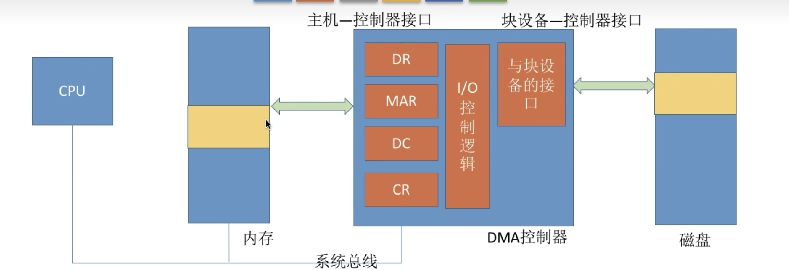

<br />DMA控制器是如何跟CPU交互的呢，它允许外部设备直接跟内存进行数据传输，而无需CPU的干预。

cpu指明此次要进行的操作，如读操作，并说明要读入多少数据，数据要存放在内存什么位置等等信息。

DMA控制器会根据cpu 提出的要求完成数据的读写工作，整块数据传输完成后，才向CPU发出中断信号。

我们用键盘输入的字符主要是跟后端联调的fetch请求的代码。如下
```
fetch(url).then( response=>console.log(response))
```

其实这也牵扯到常见的面试题，就是tcp的三次握手，这次我们从更底层的角度去看，如何通过网卡这个i/o设备去建立tcp连接。

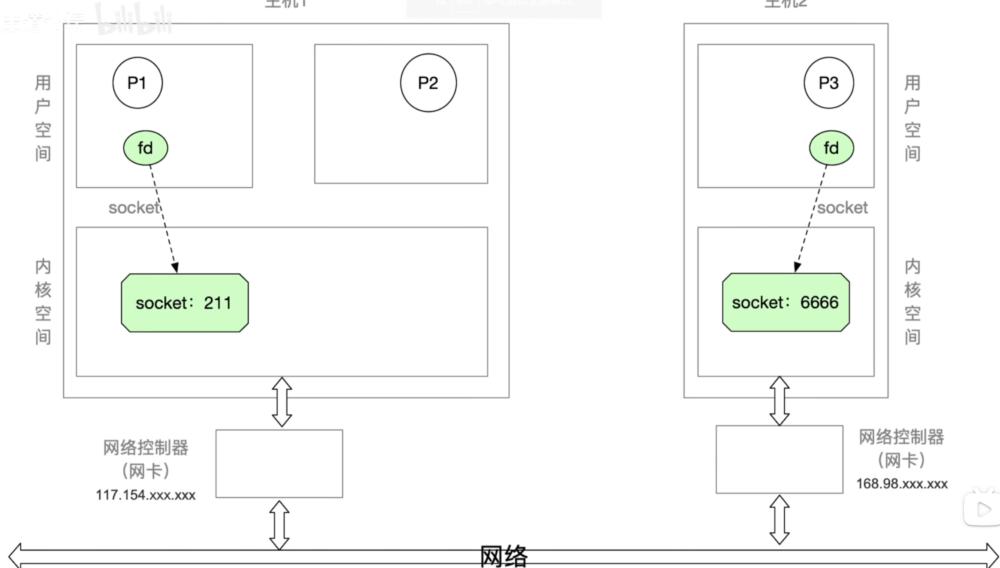

<br />上图左边是主机1，也就是我们前端的电脑，右边是主机2，也就是后端的电脑。

我们发起请求的时候，先是我们调用fecth请求，浏览器会调用sokcet系统调用，创建一个套接字，网络套接字你可以理解为申请一片内存空间，用来接收和发送数据。

socket系统调用会给用户返回一个fd，也就是文件描述符（指向套接字的一个引用），然后浏览器调用bind函数（操作系统提供的系统调用），用来绑定本机的一个端口，不同的端口意味着不同的应用在提供服务，需要通过端口号来区分不同的应用。

最后浏览器会调用connect函数（也是操作系统提供的系统调用），把fd传进去，例如connect（fd，ip地址等等参数），最后会跟服务器建立连接。

最后浏览器通过write调用（把我们fetch函数里传的数据传输出去）数据存通过write调用传输到网卡上，网卡再传输到网络中去。
## 总结：用户层软件调用I/O设备的过程
算是把上面关于io设备的知识做一个串联。<br />

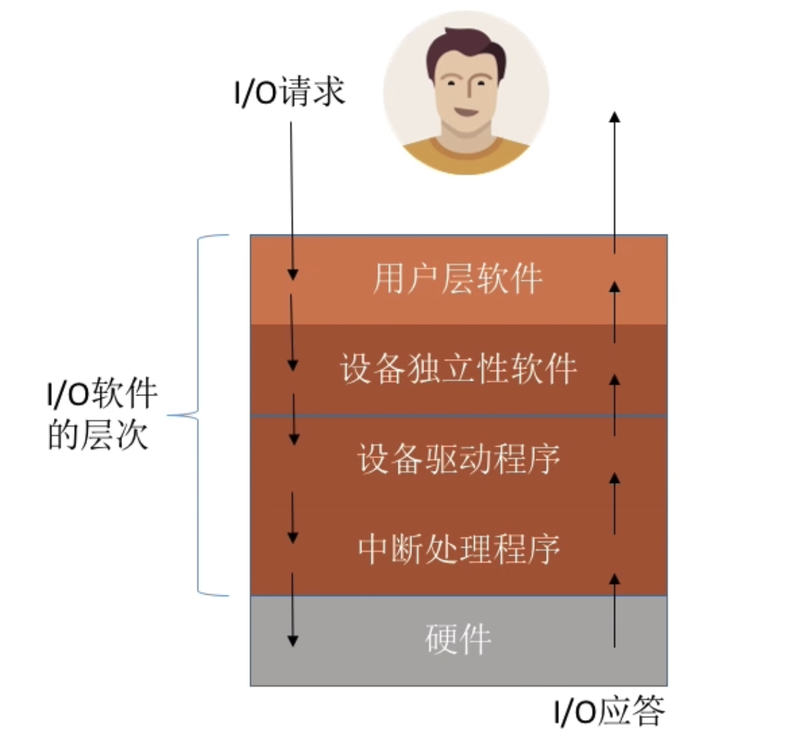

<br />如上图，我们简单描述一下浏览器调用io设备（如上图，用户层软件我们假设位是浏览器）的流程，浏览器肯定可以调用网卡这个设备的，因为我们需要http请求跟后端交互。

那么最终浏览器调用的是操作系统提供的write函数，这个write函数就是上图的设备独立性软件提供的，也是操作系统提供的。同时它还负责调用相应的驱动程序。

为什么需要驱动程序呢（如上图第三层），因为网卡是有不同的产品的，比如用A厂家的网卡和B厂家的网卡，可能在一些实现细节上不一样，比如发送数据A厂家调用自己的writeA函数，B厂家叫writeB，所以最终还需要驱动程序来实现真正最后调用硬件的细节代码。

所以为了屏蔽这些差异，外部接入设备一般都要写自己的驱动程序。

这就是一个用户从软件层面再到真实调用物理io设备的流程，当然，我们最终让操作系统完成写网卡这个操作是需要发出中断请求的，从而从用户态进入内核态，让操作系统去完成。相同，当io设备返回数据的时候，比如后端的数据又经过我们的网卡返回的时候，也是需要中断告诉操作系统，此时有数据来了，cpu需要马上安排一下。

好了，到此为止上面简单的介绍了i/o设备的管理，看到这里再给你点个赞<br />


# 前端代码案例
上面一直说，无论是i/o设备还是从磁盘读取的数据，最终都要先到内存，才能被cpu调度。我们先来看一个很直接的案例，到底我们写的前端代码是如何存储在内存的。

例如代码如下：
```javascript
const global = 100;
function f(x, y) {
  const p = {};
  return;
}
function g(a){
  f(a, a+1);
  return;
}
function main(){
  const i = 100;
  g(100);
  return;
}
main();
```
在内存里，我们代码存放主要分为

- text：代码段
- data：全局和静态变量数据
- stack：栈用于存放局部变量，函数返回地址
- heap：堆用于程序运行时动态分配内存

如下图：<br />

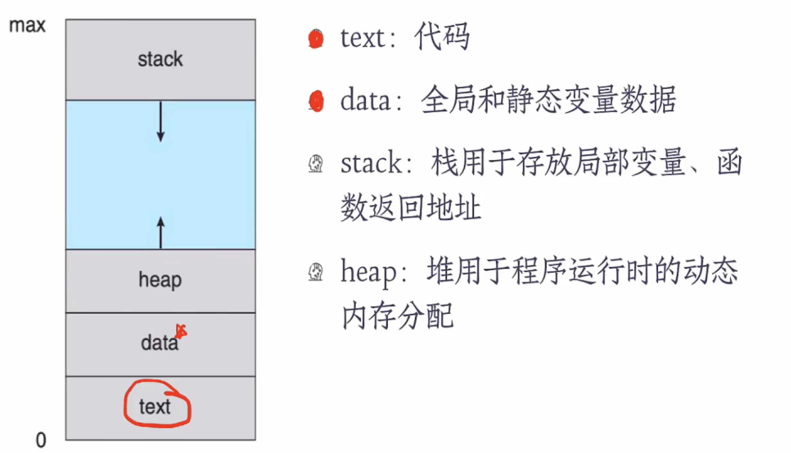

<br />之前我们写的前端代码要开始运行了，我们的前端代码是存储在text区域的，对于一些静态语言来说，text是2进制的binary code，而对于javascript这种解释性语言，存储的就是我们写的前端js代码，只有在执行的时候才会去解释和编译为2进制的机器码，再执行。

我们从上到下执行之前写的前端代码，首先
```
const global = 100;
function f(x, y) {
    const p = {};
    return;
}
function g(a){
    f(a, a+1);
    return;
}
function main(){
    const i = 100;
    g(100);
    return;
}
```
这是全局变量，存放到data区域，f、g和main也是全局函数，所以也会存放在data区域。<br />然后，开始执行main函数
```
main();
```
main函数执行，里面代码就开始执行了,只要执行函数，就会把它的返回地址写入到stack中，这样方便我们执行完毕后，再返回到这个函数向下执行。所以此时stack区域是<br />


<br />然后执行main函数里的内容
```
function main(){
    const i = 100;
    g(100);
    return;
}
```
i变量是局部变量，所以存放在stack区域，然后继续执行g(100)，此时stack区域是这样的<br />

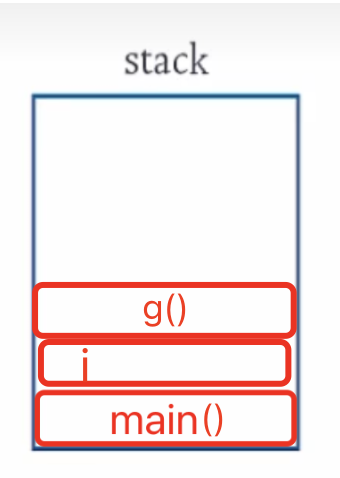

<br />然后接着g函数执行，g函数执行后，f函数又开始执行，f函数中声明了一个对象，对象在js语言里是被存放到堆，也就是heap区域，所以此时heap区域就有了数据。此时stack如下图：<br />


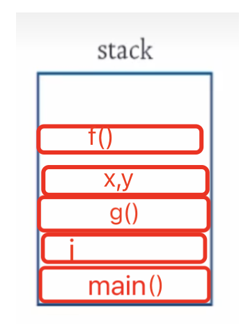

<br />每次函数调用的时候，都会把返回地址压入栈（stack）中，那么函数执行完毕，则根据返回地址弹出stack。<br />可是这里有一个很重要的点，就是局部变量x、y和i瞬间就销毁了，但是在heap区域里的数据不是瞬间销毁的，是需要靠垃圾回收机制销毁。<br />这就涉及到内存的回收，我们的操作系统如何回收heap里的数据呢？<br />这里我们延伸一下，看看node.js中的v8引擎是用了什么回收算法（下面主要介绍了分带回收和标记清除算法）。
# 从Node.js 的V8如何使用内存来进入内存知识点
使用node.js的api : process.memoryUsage(),返回如下
```
{  rss: 4935680,  heapTotal: 1826816,  heapUsed: 650472,  external: 49879 }
```
heapTotal 和 heapUsed 代表V8的内存使用情况。也就是之前我们提到的heap区域的使用情况。

external代表V8管理的，绑定到Javascript的C++对象的内存使用情况。

 rss, 其实就是占用的所有物理内存的大小，是给这个进程分配了多少物理内存，也就是我们上面 提到的，这些物理内存中包含堆，栈，和代码段等等。
## V8的内存分代和回收算法请简单讲一讲
在V8中，主要将内存分为新生代和老生代两代。新生代中的对象存活时间较短的对象，老生代中的对象存活时间较长，或常驻内存的对象。<br />


#### 新生代
新生代中的对象主要通过Scavenge算法进行垃圾回收。这是一种采用复制的方式实现的垃圾回收算法。它将堆内存一分为二，每一部分空间成为semispace。在这两个semispace空间中，只有一个处于使用中，另一个处于闲置状态。处于使用状态的semispace空间称为From空间，处于闲置状态的空间称为To空间。


- 当开始垃圾回收的时候，会检查From空间中的存活对象，这些存活对象将被复制到To空间中，而非存活对象占用的空间将会被释放。完成复制后，From空间和To空间发生角色对换。
- 因为新生代中对象的生命周期比较短，就比较适合这个算法。
- 当一个对象经过多次复制依然存活，它将会被认为是生命周期较长的对象。这种新生代中生命周期较长的对象随后会被移到老生代中。
#### 老生代
老生代主要采取的是标记清除的垃圾回收算法。与Scavenge复制活着的对象不同，标记清除算法在标记阶段遍历堆中的所有对象，并标记活着的对象，只清理死亡对象。活对象在新生代中只占叫小部分，死对象在老生代中只占较小部分，这是为什么采用标记清除算法的原因。
#### 标记清楚算法的问题
主要问题是每一次进行标记清除回收后，内存空间会出现不连续的状态<br />


- 这种内存碎片会对后续内存分配造成问题，很可能出现需要分配一个大对象的情况，这时所有的碎片空间都无法完成此次分配，就会提前触发垃圾回收，而这次回收是不必要的。
- 为了解决碎片问题，标记整理被提出来。就是在对象被标记死亡后，在整理的过程中，将活着的对象往一端移动，移动完成后，直接清理掉边界外的内存。

到这里，我们了解对前端代码在内存的简单分配和回收有了大致的了解，那么我们现在就要更深入的了解一些关于内存管理的其他知识了。<br />首先
## 内存是如何存储数据的呢？
首先，我们要知道内存也是分块的，我们都知道酒店会有很多房间，房间会有很多编号，其实内存也类似，如下图<br />


<br />然后就是具体存放数据了，一般情况下，大家都会想，当然连续存放呗，例如a程序占据内存块1号，b程序占据内存块2号，依次类推。

这其实是连续存放的思想，连续存放我们在讲磁盘存数据的时候也讲过，连续存放会导致很多严重的问题，例如，a,b,c程序在内存的排放方式如下：
```
A文件占据的内存块 | B文件占据的内存块 ｜ C文件占据的内存块
```
此时，如果A程序产生了很多局部变量，也就是要存放到A程序占有内存的stack区域，因为ABC文件占据内存是连续存放的，我们不得不把B和C往后移动。(是不是跟磁盘管理的案例差不多)<br />所以往往会采取分连续分配内存块的算法。分连续分配有分段和分页算法。这里我们简单介绍一下分页算法，分段算法就不多说了，思想是一样的，在linux操作系统中，其实采取的是类似分页的算法，叫buddy算法，buddy的意思是伙伴，好朋友的意思，所以也叫伙伴算法。<br />分页算法是把内存空间分为一个个大小相等的分区，一般每个分区是4k，我们称之为页框。<br />同时将进程的逻辑地址空间也分为与内存页框相等的一个个部分，我们把每个部分称为“页”，如下图<br />

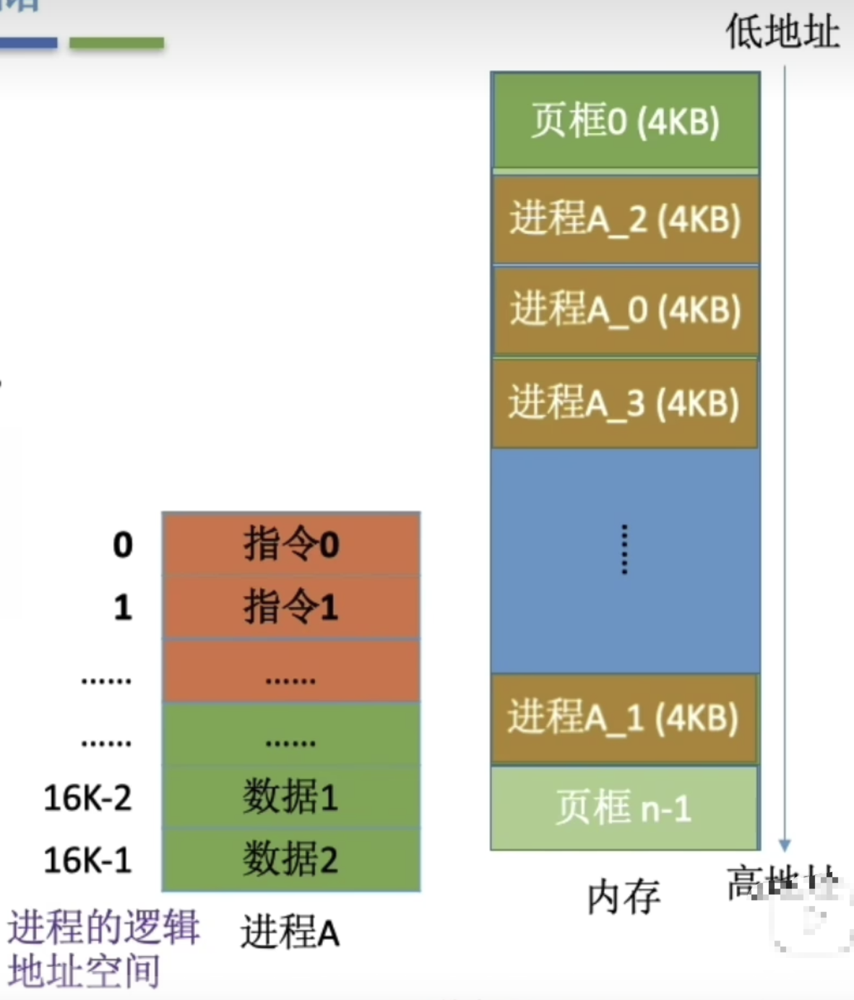

<br />所以我们把进程逻辑上的数据分为一个个4kb的块，在内存上任意地方存放，从而实现数据在内存的非连续存放。<br />有的同学肯定想，分散后，我咋知道内存上哪些部分是存放进程A数据的呢？所以我们还需要一个表，记录进程上的逻辑块号，跟内存上的块号的映射关系。<br />

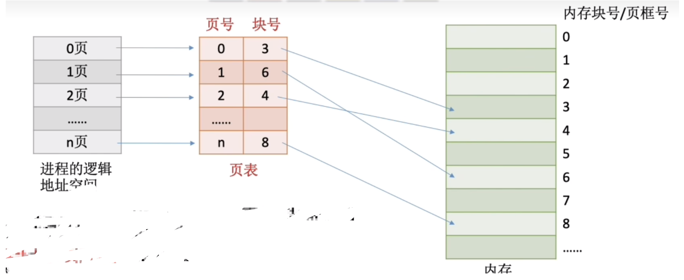

<br />其实真实的分页处理要比这个复杂很多，例如linux的伙伴算法，可以有效的减少内部碎片，还采用了slab分配机制。（更详细内容建议搜索谷歌，不过对我们前端来说不了没啥影响）<br />这里再简单介绍一个知识点，例如我们的计算机内存是8GB，但是一个大型游戏可能有10GB大，显然，内存是不够大，加上我们的电脑同时还运行着很多别的程序，所以我们的计算机到底是怎么做到呢？<br />这也是非常非常重要的一个概念，叫虚拟内存
## 什么是虚拟内存？为什么需要它？
虚拟内存 使得应用程序认为它拥有连续的可用的内存（一个连续完整的地址空间），而实际上，它通常是被分隔成多个物理内存碎片，还有部分暂时存储在外部磁盘存储器上，在需要时进行数据交换。<br />举个例子，我们玩的游戏假如有10G,但是目前内存只有4G,实际上我们的计算机只会加载部分游戏数据到内存中，因为全部的游戏数据，在我们当前的画面不会全部用到，我们只把用到的加载进来，这叫做局部性原理，它是指处理器在访问某些数据时短时间内存在重复访问，某些数据或者位置访问的概率极大，大多数时间只访问局部的数据。<br />如果要加载新的页面，例如你玩游戏进入了新的场景，需要加载新的数据，同时也需要把已经在内存的老数据置换出去，就会触发缺页中断，告诉操作系统要置换数据了。<br />此时涉及到置换算法，这里就有一个很常见的置换算法叫LRU页面置换算法，也算是前端面试很常见的leetcode面试题了。
# 进程和线程
最后，我们要来讲讲进程和线程了，还是拿我们熟知的前端代码，我们上面已经知道前端代码运行时在内存的表现形式，那么cpu内部是如何一条一条取指令来运行的，这里首先就会有一个问题了，就是指令是什么？
## 指令是什么？（了解）
它是指计算机执行某种操作的命令，是计算机运行的最小功能单位。一台计算机的所有指令的集合构成该机的指令系统，也称为指令集。比如著名的x86架构（intel的pc）和ARM架构（手机）的指令集是不同的。<br />


<br />一条指令就是机器语言的一个语句，它是一组有意义的二进制代码。一条指令通常包括操作码（OP） + 地址码（A）

- 操作码简单来说就是我要进行什么操作，比如我要实现1+1，加法操作，停机操作等等
- 地址码就是比如实现加法操作的数据地址在哪，通常是内存地址。
## cpu是如何去内存取指令，然后一步一步执行的呢？（了解就行）
首先，是取指令的过程如下<br />


- 我们简单描述，就是CPU要知道下一条指令是什么，就必须去存储器（内存）去拿，PC去了存储器的MAR拿要执行的指令地址，MAR（存储器里专门存指令地址的地方）
- 第二步和第三步，MAR去存储体内拿到指令之后，将指令地址放入MDR(存储器里专门存数据的地方)
- 然后MDR里的数据会返回给CPU
- 比如这条指令是计算1+1等于几，CPU会把这个任务交给内部的运算器，计算完毕，指令会告诉你把计算结果放到内存的哪个位置，上面我们知道内存逻辑上是按块存储的，比如告诉我们放到20号内存块，cpu就放过去，这样一条指令执行完毕，cpu就会接着执行程序的下一条指令。
## 为什么需要进程
因为我们的计算机是多道程序并发执行（多核cpu可以并行），假如我们现在只有一个cpu，那么为什么我们能同时打开qq聊天，还可以听着网易云音乐呢，这是两个不同的app，我们用起来好像它们就是并行的。<br />可实际上，微观层面，cpu是并发执行，也就是cpu会有一个时间片，先给qq程序一小段时间使用，然后马上切换到网易云音乐程序，只是快到我们使用者层面觉得是两个程序同时在运行。<br />这里面就涉及到两个问题？一是cpu时间片如何设计调度算法，比如有很多紧急的任务，我们一般都要先执行紧急的任务，但是如果紧急任务特别多，其他一些不紧急的任务就得不到时间片，就无法执行，这是问题。二是，时间片运行的程序实际上在操作系统层面是以进程为单位调度的，这些进程是如何表示的。<br />我们先来看第一个问题
## CPU调度进程的算法
其实有很多算法，比如先来先服务，短作业优先等等，这些我们都不讲，对于我们前端来说，其实大概知道，cpu执行程序的指令，是以时间片的形式，时间到了，会有外中断（操作系统提供的时钟管理强制打断目前的执行的程序）然后切换为另一个程序执行。<br />对于我们前端而言，了解进程和线程本身的运行机制，尤其对于后续做nodejs开发尤为重要，到底进程包含了哪些东西。<br />之前我们知道，一个程序运行的时候在内存实际上包含

- text：代码段
- data：全局和静态变量数据
- stack：栈用于存放局部变量，函数返回地址
- heap：堆用于程序运行时动态分配内存

其实还有一个更重要的东西，叫进程控制块（PCB），为什么需要这么一个东西呢，一个程序运行的标志是有进程正在被调度，当一个程序时间片到了切换到另一个时间片到时候，我们是不是保存上一个程序的状态，比如代码在内存哪些地方，引用的文件有哪些（当前进程打开的文件，回顾文件系统篇的内容），进程状态，pid（进程id）等等信息。<br />并且实际进程切换的时候，就是PCB的切换，因为有了PCB，进程的所有信息都可以找到。<br />到此为止，我们知道操作系统调度程序的基本单位是进程。这有什么问题，进程增加的操作系统的并发能力，但是并没有增加单个程序的并发能力，什么意思呢？比如我用qq的时候，是既可以聊天，又可以视频，这是单个程序的并发能力，如何实现呢？<br />这时，我们的线程就登场了，一个进程有多个线程，这样单个程序也具备并发能力了。如下图：如果只有一个线程就入下图的左侧部分，多线程的话就是下图右侧部分。<br />

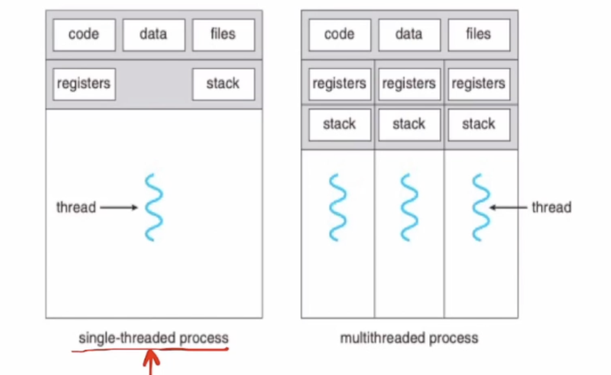

<br />我们可以看到，线程共享了代码段，数据，files（当前打开的哪些文件），pcb等信息。<br />而每个线程单独拥有registers（寄存器空间），stack（栈，放局部变量）<br />跟进程相关的最最常见的node.js相关的两道面试题是：

- 进程间通信有哪些方式，并要了解其特点
- 进程和线程的区别是什么
## 进程间通信有哪些方式
每个进程的用户地址空间都是独立的。通常是不能互相访问。然而，内核空间是每个进程都共享的。因此可以通过内核来在进程间传递信息。<br />

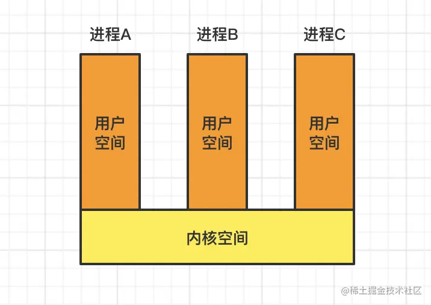
## 共享内存
共享内存通过将一块虚拟地址空间映射到相同的物理内存中，实现了进程间数据的即时共享。这种方式避免了频繁的拷贝和传输过程，极大地提升了进程间通信的效率。<br />

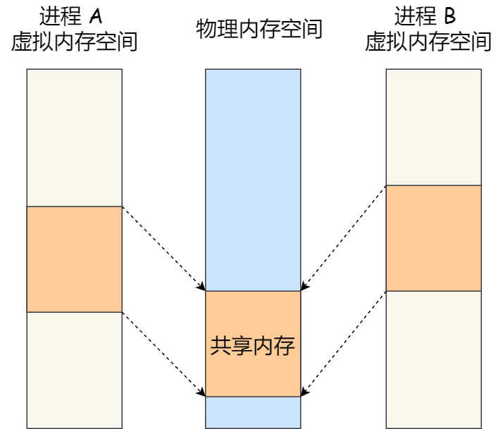
## 信号
在 Linux 操作系统中， 为了响应各种各样的事件，提供了几十种信号，分别代表不同的意义。我们可以通过 kill -l 命令，查看所有的信号：
```
$ kill -l1) SIGHUP       2) SIGINT       3) SIGQUIT      4) SIGILL       5) SIGTRAP6) SIGABRT      7) SIGBUS       8) SIGFPE       9) SIGKILL     10) SIGUSR1
11) SIGSEGV     12) SIGUSR2     13) SIGPIPE     14) SIGALRM     15) SIGTERM
16) SIGSTKFLT   17) SIGCHLD     18) SIGCONT     19) SIGSTOP     20) SIGTSTP
21) SIGTTIN     22) SIGTTOU     23) SIGURG      24) SIGXCPU     25) SIGXFSZ
26) SIGVTALRM   27) SIGPROF     28) SIGWINCH    29) SIGIO       30) SIGPWR
31) SIGSYS      34) SIGRTMIN    35) SIGRTMIN+1  36) SIGRTMIN+2  37) SIGRTMIN+3
38) SIGRTMIN+4  39) SIGRTMIN+5  40) SIGRTMIN+6  41) SIGRTMIN+7  42) SIGRTMIN+8
43) SIGRTMIN+9  44) SIGRTMIN+10 45) SIGRTMIN+11 46) SIGRTMIN+12 47) SIGRTMIN+13
48) SIGRTMIN+14 49) SIGRTMIN+15 50) SIGRTMAX-14 51) SIGRTMAX-13 52) SIGRTMAX-12
53) SIGRTMAX-11 54) SIGRTMAX-10 55) SIGRTMAX-9  56) SIGRTMAX-8  57) SIGRTMAX-7
58) SIGRTMAX-6  59) SIGRTMAX-5  60) SIGRTMAX-4  61) SIGRTMAX-3  62) SIGRTMAX-2
63) SIGRTMAX-1  64) SIGRTMAX
```
在Shell终端中运行的进程可以在键盘上按下特定的组合键，然后向进程发送信号实现不同的操作。举例来说：

- 按下Ctrl+C会产生SIGINT信号，表示要终止该进程；
- 按下Ctrl+Z会产生SIGTSTP信号，表示要停止该进程，但尚未完全结束。

如果进程在后台运行，我们可以通过kill命令发送信号给进程，前提是我们需要知道正在运行进程的PID号。例如：

- 使用"kill -9 1050"命令，表示向PID为1050的进程发送SIGKILL信号，以立即终止该进程。

因此，信号的来源主要分为硬件来源（例如键盘的Ctrl+C）和软件来源（例如kill命令）。<br />因此，我们也可以在例如node.js中监控这些信号，例如：
```javascript
// 监听SIGHUP信号
process.on('SIGHUP', () => {
  // 在此处编写处理SIGHUP信号的逻辑
  console.log('Received SIGHUP signal');
  // 进行相关操作
});
```
## Socket
之前我们已经介绍过sokcet的创建流程了，这里我们主要讲的是node.js中在linux中的进程间通信方式，domain socket。<br />socket可以进行网络通信，我们之前讲过。<br />实际上，Socket 通信不仅可以跨网络与不同主机的进程间通信，还可以在同主机上进程间通信。<br />我们来看看创建 socket 的系统调用：
```
int socket(int domain, int type, int protocal)
```
本地字节流 socket 和 本地数据报 socket 在 bind 的时候，不像 TCP 和 UDP 要绑定 IP 地址和端口，而是绑定一个本地文件，这也就是它们之间的最大区别。<br />前端了解到这个程度就差多了。

# 进程、线程和协程的区别
## **一、进程**
进程，直观点说，保存在硬盘上的程序运行以后，会在内存空间里形成一个独立的内存体，这个内存体有自己独立的地址空间，有自己的堆，上级挂靠单位是操作系统。操作系统会以进程为单位，分配系统资源（CPU时间片、内存等资源），进程是资源分配的最小单位。
## 二、线程
线程，有时被称为轻量级进程(Lightweight Process，LWP），是操作系统调度（CPU调度）执行的最小单位。
## **三、协程**
**协程是一种用户态的轻量级线程，**协程的调度完全由用户控制。协程拥有自己的寄存器上下文和栈。协程调度切换时，将寄存器上下文和栈保存到其他地方，在切回来的时候，恢复先前保存的寄存器上下文和栈，直接操作栈则基本没有内核切换的开销，可以不加锁的访问全局变量，所以上下文的切换非常快。

协程在子程序内部可中断的，然后转而执行别的子程序，在适当的时候再返回来接着执行。
## **四、进程和线程的区别与联系**
进程适合跟线程做比较，他们的区别是：

- 根本区别：进程是资源分配的最小单位，线程是操作系统调度（CPU调度）执行的最小单位
- 从属关系不同: 进程中包含了线程，线程属于进程。一个进程可以有很多线程，每条线程并行执行不同的任务。
- 拥有资源：进程是拥有资源的一个独立单位，线程不拥有系统资源，但可以访问隶属于进程的资源。
- 系统开销：多进程的程序要比多线程的程序健壮，但在进程切换时，耗费资源较大，效率要差一些。

协程适合跟线程做比较：他们的区别是：<br />**协程的特点在于是一个线程执行，那和多线程比，协程有何优势？**

1. 调度方式：线程是由操作系统内核进行调度的，它们是操作系统的原生概念。而协程是由用户空间的程序自行调度的，它们依赖于特定的协程库或框架。

2. 并发性：在多线程编程中，多个线程可以同时执行，并行地运行在多个物理或逻辑处理器上。而协程是在单个线程上运行的，通过协程调度器在不同的协程之间进行切换，实现并发执行。

3. 切换开销：线程之间的切换通常需要操作系统内核的介入，需要保存和恢复线程的上下文，这涉及到较大的开销。而协程的切换是由用户程序自行控制的，切换时只需保存和恢复协程的上下文，开销较小。

4. 内存占用：每个线程都需要独立的堆栈空间和内核数据结构，因此线程的内存占用比较大。而协程可以共享相同的堆栈空间，因此在内存占用方面比较轻量级。

好了，文章结束，能看到这里敬你是条汉子！<br />


欢迎了解更多【前端的后端知识体系】。对于前端有一些专家级别的学习资料，例如前端react组件库实现（对标主流react组件库几乎全部功能）。

注：<br />本文绝大多数资料来源于以下的视频资料

- [Linux 操作系统(UP主 Y4NPY)](https://www.bilibili.com/video/BV147411G7zD/?spm_id_from=333.788&vd_source=390dcaa2c5b1a18d291c9af7c53f6540)
- [操作系统_清华大学（陈渝）](https://www.bilibili.com/video/av6538245?from=search&seid=6918809747167691096)
- [2019 王道考研 操作系统](https://www.bilibili.com/video/av70156862?from=search&seid=6918809747167691096)
- 小林coding
